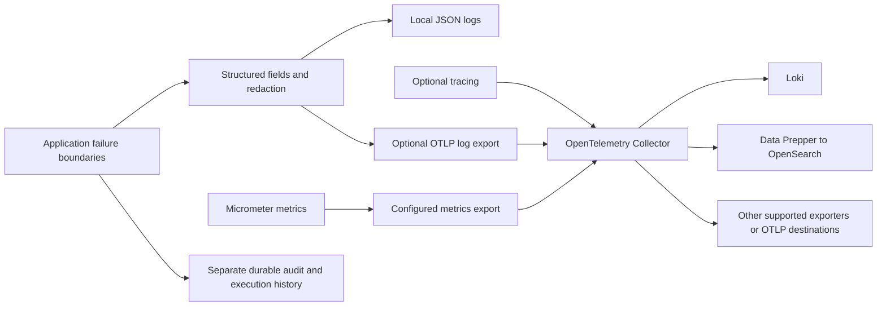

# Exception handling and portable telemetry: code audit and options

**Date:** 2026-09-28  
**Source revision:** `e4cd69e2d358ed61e9e40a583c8bf470665f477e`  
**Status:** investigation and recommendation; no runtime changes or dependency selection approved here.  
**Tracking:** [#270 — correlated diagnostics and organization export](https://github.com/msabiransari/datapipelines/issues/270), [#266 — audit/event persistence](https://github.com/msabiransari/datapipelines/issues/266), [#231 — management-port access](https://github.com/msabiransari/datapipelines/issues/231). GitHub remains authoritative for delivery status.

**Tracking update:** the audit summary and actionable follow-up findings were [posted to #270 and verified](https://github.com/msabiransari/datapipelines/issues/270#issuecomment-5880592196). The earlier connector approval block is resolved. No issue or project status was changed; implementation remains pending. These research documents are still local and uncommitted, and are evidence rather than a replacement issue tracker.

## 1. Findings that affect the decision

There are exceptions whose cause is discarded without a log or a returned error. There are also deliberate catches that log a failure and continue, including failures to persist execution history. These are different problems: adding an exporter helps the second category, but cannot recover an exception discarded by the first.

The checked-in application has SLF4J/Logback logging, Micrometer instrumentation, HTTP correlation IDs, execution events and database audit records. The observability specification describes a more complete system than the code currently wires. Its JSON/redacting encoder, OpenTelemetry initialization/export and Prometheus registry are not established by the current source or production lockfile. The existing observability environment variables are not evidence that switching them on delivers those capabilities.

**Recommendation for design:** use OpenTelemetry Protocol (OTLP) as the product's external telemetry contract and an OpenTelemetry Collector as the backend adapter. Retain Micrometer for metrics and SLF4J for application logging. Provide an explicit, disabled-by-default export mode, with independently selectable logs, metrics and traces. This is a recommendation, not an implemented feature. The Collector supports configurable processing and delivery to multiple backends. [OpenTelemetry Collector](https://opentelemetry.io/docs/collector/)

“Any technology” should mean **an OTLP-compatible destination, or a destination supported by a tested Collector exporter/adapter**. No protocol guarantees compatibility with every search index or every vendor feature. Publish supported configurations and a compatibility contract, rather than promising every technology in the industry.

## 2. What counts as swallowing an exception

| Classification | Meaning | Appropriate response |
|---|---|---|
| Silent operational suppression | A failed operation becomes success, no result, a default, or continued execution with no diagnostic evidence | Review first; preserve the cause and define the caller-visible outcome |
| Logged suppression | A WARN/ERROR exists, but the operation continues without completing its original responsibility | Decide whether the contract permits loss; logging is evidence, not recovery |
| Expected fallback | Malformed optional input, unsupported driver capability, disconnected reader, or a documented optional feature has a deliberate alternate path | Keep the fallback where justified; narrow exception types and make degradation observable where useful |
| Translation or propagation | The failure becomes a typed error, error response, failed execution, or is rethrown | Usually correct; verify cause preservation and one diagnostic boundary |
| Deferred handling | A failure remains in a Result/future and is handled by its consumer | Trace the consumer before calling it swallowed |

“Deal with all exceptions” should mean every failure has an explicit owner, outcome and evidence policy. It should not mean logging every invalid UUID at ERROR, catching every Throwable, or converting cancellation into success. On cleanup after an existing failure, preserve the original failure and retain secondary failures as suppressed causes or bounded diagnostics. On a successful path, a failed commit cannot be treated as harmless cleanup.

## 3. Current logging and diagnostics: source facts

Paths below are relative to the repository. Line numbers refer to the audited revision.

| Capability | What the source establishes | Gap / limit |
|---|---|---|
| Logging implementation | `modules/app/gradle.lockfile:6` locks production Logback Classic 1.5.34. Application classes call SLF4J, including `ApiExceptionHandler`, `AuditLogger`, and `WebEventEmitter` | A logger dependency is not a structured export pipeline |
| JSON output | `docs/observability.md` §3.1 specifies logstash-logback-encoder; `application.yml:357` declares the product logging-format setting | No tracked Logback configuration, logstash encoder dependency, or binding/consumer implementing this format switch was found. Checked-in defaults do not establish JSON output. Runtime overrides were not inspected |
| Central redaction | `docs/observability.md` §9.2 specifies an MDC sanitizing filter and redacting message converter | Neither named component nor an equivalent globally wired logging encoder/filter was found. Some paths have local protection: `datasources/ErrorText.kt:76` scrubs datasource error messages; several credential classes redact `toString()`. Local protection does not establish sanitization for every log/appender |
| HTTP error boundary | `web/api/ApiExceptionHandler.kt:289` handles unexpected Throwable, logs ERROR with the cause and returns an error envelope. Its `logAt` distinguishes ordinary 4xx from server failures | This does not observe exceptions consumed inside lower-level catches; filter, background, SSE and MCP boundaries require their own handling |
| Correlation | `web/CorrelationIdFilter.kt:39` sets request MDC and clears it at line 44. `web/api/CorrelationId.kt` resolves UUIDs. `WebEventEmitter` explicitly projects a correlation ID into SSE and execution records | Searches found no `MDCContext` or `TaskDecorator` wiring. An ID in a payload or database row does not prove the MDC follows dispatcher/thread changes. There is no established trace context yet |
| Metrics | `ExecutorMetrics`, `SchedulerMetrics`, `WebMetrics`, `MicrometerPoolLifecycleMetrics` and limiter counters use Micrometer. `web/config/EngineConfiguration.kt:126` supplies a conditional `SimpleMeterRegistry` fallback | Production lockfile has no Prometheus or other remote registry. Not every metric listed in the spec is proven implemented; in particular no production source emission for the spec's `datapipelines.errors.total` was found |
| Management endpoint | `application.yml:108–126`: separate management port, loopback default, only health exposed | Prometheus is explicitly described as arriving later. Existing issue #231 records that management requests also encounter application authentication. Scrape authentication/network policy needs a decision |
| OpenTelemetry | `docs/observability.md` §5 describes initialization, instrumentation, OTLP and sampling; `application.yml:358` declares tracing enabled | No OpenTelemetry SDK/starter/exporter in the production lockfile, no source initialization/instrumentation, no shipped Collector configuration found. Setting the current tracing switch is not a verified export mechanism |
| Deployment knobs | `deploy/compose.yml:208,270` passes logging-format and tracing-enabled values; `deploy/env/defaults.env:262,264` sets local console/disabled values | These values do not install or wire an encoder/exporter. The inspected compose file does not establish an OTLP destination |
| Audit history | `auth/AuditLogger.kt` inserts into PostgreSQL `audit_log` and catches database failures with a WARN | A failed insert can be absent from the audit table even though the caller continues. Exporting operational logs does not make this record durable |
| Execution history | `web/sse/WebEventEmitter.kt` sends live events and writes execution/event records, with logged persistence failures; Redis replay is another path | Live delivery, durable history and replay can disagree. Scheduled executions have a specific fail-closed initial-record barrier; interactive runs retain the continue-on-record-failure policy |
| Static guard | `config/detekt/detekt.yml:52` enables `SwallowedException`; `CommonConventionsPlugin.kt:185` builds upon default detekt rules | Existing catches show that the guard is not proof of a complete error policy. Results discarded by `runCatching`, intentional suppressions, frontend promises and shell exit masking need additional review |

The two independent checks behind the negative claims were (1) tracked configuration/build/dependency files, including `modules/app/gradle.lockfile`, and (2) all production sources, searching both named components and framework sink/API types. No deployed process, live environment, raw production logs or runtime-injected agent was inspected. External operators could inject logging or agents beyond what the repository provides.

## 4. Exception inventory and consequential findings

The companion inventories enumerate the scanned sites and separate silent suppression from expected fallback and reported failures. Their counts measure source handling sites, **not confirmed defects**. The inventories include module scope, exclusions and per-site classifications:

- [Execution, datasource and domain inventory](2026-09-28-exceptions-domain.md).
- [HTTP, MCP, auth and application inventory](2026-09-28-exceptions-boundaries.md).
- [Browser, build and script inventory](2026-09-28-exceptions-browser-and-scripts.md).

The Kotlin review covers **708 production files and 451 handlers** (342 `catch` clauses and 109 `runCatching` calls), plus five independent Result handlers. An independent lexical scan masking comments and string literals matched all 451 inventory locations, with zero unmatched sites in either direction. Classification totals: **24 locally silent discards, 82 logged suppressions, 55 fallbacks, 290 explicit failure/rethrow paths**. The five separate Result handlers also report failures. Browser coverage adds **46 catch clauses and three Promise rejection handlers**; the script appendix includes eight Python catches and the enumerated shell suppression sites. Test-tool findings are identified separately from product behavior.

### Verified high-consequence examples

1. **Commit failure discarded:** `modules/dag/src/main/kotlin/co/datapipelines/executor/NodeRunner.kt:848` runs `runCatching { conn.commit() }` in `datasourceQuery`'s finally block and discards the Result. The try can return a successful NodeResult. Its own comment permits DQL multi-statement side effects, so a commit failure can invalidate a success result; on a prior failure the commit failure is also lost. A corrective design must separate successful finalization from cleanup while unwinding. Static finding; no driver failure injected in this audit.
2. **History writes reported but not recovered:** `WebEventEmitter.kt:188,209,281` logs append/create/complete failures and continues. The scheduler-specific initial-record barrier at line 181 is an important exception. Missing terminal writes can leave stale history even after a client sees completion. This belongs with #266's durability and recovery contract.
3. **Diagnostic context silently degraded:** `WebEventEmitter.kt:280` discards context-snapshot serialization failure; line 311 discards the aborted-duration database read failure and returns zero. The terminal record may retain its insert-time parameters or an artificial zero duration without explaining the degradation.
4. **Audit insert failure contained:** `modules/auth/src/main/kotlin/co/datapipelines/auth/AuditLogger.kt:49` warns on DataAccessException and returns normally. This is intentional logged suppression, not an empty catch. A required audit guarantee must specify a durable handoff/recovery policy; forwarding its warning does not repair the missing row.
5. **Failed reads look like empty workspace state:** `web/ui/WorkspacesUiController.kt:103,114` converts member/invitation and key-owner read failures into empty UI state. Permission refusals, database failures and programming failures are collapsed together. A degraded-state response should be distinguishable from an empty membership list.
6. **Browser cancellation and version-selection evidence lost:** `static/js/pipeline-editor/sse.js:455` swallows a rejected cancellation request and never checks HTTP status before scheduling reader abort. `pipeline-editor/draft.js:27` converts malformed lifecycle JSON into no draft, causing the run path to omit the draft pin. Both need visible failure handling; disconnect-grace cancellation is not proof that the requested DELETE succeeded.
7. **Scheduled outcome classification loses its input:** `web/schedules/PipelineJobExecutor.kt:420,428` suppresses persisted JSON parsing errors that distinguish instance loss and user cancellation. The fallback can report ABORTED where the intact marker would have selected UNKNOWN or CANCELLED.
8. **Heartbeat degradation may be invisible at normal log levels:** `dag/executor/ExecutionProgress.kt:141,149` records persistence failures only at DEBUG. Persisted state can lag live work, and the stale-execution sweeper relies on heartbeat age. A collector operating above DEBUG will receive no such diagnostic.

The inventories contain additional silent UI/read/cleanup cases and their consequences. Their proposed responses are review recommendations, not changes to the existing product contract.

## 5. Logs, metrics, traces and audit records serve different purposes

| Signal / tool | Purpose | Relationship to this request |
|---|---|---|
| Logs | Individual diagnostic events with contextual fields and exception evidence | The searchable exception evidence requested here |
| Metrics | Counts, rates, durations, capacity and distributions | Alert on failure rates, retries, dropped logs and queue backlog |
| Traces | Timed operation spans and cross-service causality | Connect request, execution, node and outbound work; correlate using trace/span IDs |
| Audit and execution records | Product history with defined ordering, retention and durability | Preserve independently; do not substitute a sampled or lossy log export |
| Prometheus | Time-series metrics collection and querying | Useful alongside log export; it is not the general exception-log search store. [Prometheus overview](https://prometheus.io/docs/introduction/overview/) |
| Grafana / Loki | Grafana is the visualization/query UI; Loki stores logs | Send logs to Loki's supported ingestion path, then query them through Grafana. [Loki OTLP ingestion](https://grafana.com/docs/loki/latest/send-data/otel/) |
| OpenSearch / Data Prepper | Search storage and an ingestion pipeline | Data Prepper can accept OTLP logs and index into OpenSearch. [Data Prepper OTel source](https://docs.opensearch.org/latest/data-prepper/pipelines/configuration/sources/otel-logs-source/) |

Framework integration and backend integration are separate: instrument this Kotlin/Spring application once, and change destination adapters in the Collector. A JDBC datasource connector in Datapipelines is not the natural interface for operational log shipping. In OpenTelemetry terminology, a Collector “connector” connects telemetry pipelines; exporters are normally what deliver to external backends.

## 6. Recommended portable export shape



This diagram is proposed architecture. The code does not implement all its boxes today.

### Options and tradeoffs

| Approach | Benefits | Costs / caveats |
|---|---|---|
| Structured stdout + external collection | Fits the existing stdout deployment direction; app has no remote log connection; can include container/framework logs | Requires Docker/Kubernetes/host log access, parsing, rotation and cursor handling. Does not repair missing fields. Collection after stdout must not be the first redaction boundary |
| SLF4J/Logback bridge → OTLP → Collector | Typed fields and log/trace correlation; portable endpoint; fits an application-controlled export switch | Requires bridge/SDK lifecycle, bounded queue, shutdown drain and explicit MDC capture. An independent OTLP appender can bypass a console-only redactor |
| Direct vendor SDK/appender in the application | Can expose vendor-specific features | Multiplies dependencies, credentials, failure policies and upgrade work for each backend |

Recommend the OTLP path for the supported opt-in product feature, while preserving sanitized local output and documenting external stdout collection as an alternative. Choose **one ingestion path per log stream** in a deployment; enabling both OTLP and stdout collection into the same destination can duplicate records. The OTel Spring starter documents a Logback appender and MDC integration; exact dependencies and compatibility must be verified against the repository's pinned Spring/Kotlin/JDK versions during implementation. [Java starter instrumentation](https://opentelemetry.io/docs/zero-code/java/spring-boot-starter/out-of-the-box-instrumentation/)

### Destination compatibility examples

| Destination | Documented route to evaluate | Compatibility caveat |
|---|---|---|
| Grafana Loki | Collector OTLP/HTTP exporter → Loki OTLP endpoint | Structured metadata must be enabled; keep high-cardinality correlation/execution IDs out of index labels. [Loki documentation](https://grafana.com/docs/loki/latest/send-data/otel/) |
| OpenSearch | Collector → Data Prepper OTel logs source → OpenSearch sink | Match Data Prepper protocol/version, TLS/auth, field mapping and index lifecycle. This is not sending OTLP to the ordinary OpenSearch REST indexing endpoint. [OpenSearch documentation](https://docs.opensearch.org/latest/data-prepper/pipelines/configuration/sources/otel-logs-source/) |
| Elastic | Collector → supported Elastic OTLP or Elasticsearch exporter route | Deployment and version matter; documented direct Elasticsearch OTLP ingestion uses HTTP, not gRPC. [Elastic documentation](https://www.elastic.co/docs/manage-data/ingest/otlp-endpoint) |
| Datadog | Collector with Datadog exporter | Map service/environment attributes and verify the required logs pipeline and vendor feature coverage. [Datadog documentation](https://docs.datadoghq.com/opentelemetry/setup/collector_exporter/datadog_exporter/) |
| Splunk | Collector `splunk_hec` exporter → HEC | Configure token, destination/index policy and ingestion limits. [Splunk documentation](https://help.splunk.com/splunk-observability-cloud/manage-data/splunk-distribution-of-the-opentelemetry-collector/get-started-with-the-splunk-distribution-of-the-opentelemetry-collector/collector-components/exporters/splunk-hec-exporter) |
| Prometheus | Micrometer scrape endpoint or a compatible Collector metrics path | Metrics only for this design; keep a log backend for exception records. [Prometheus documentation](https://prometheus.io/docs/introduction/overview/) |
| Other commercial, cloud or custom destinations | OTLP endpoint where supported; otherwise a Collector distribution containing an appropriate exporter | Verify signal support, exporter maturity, authentication, retry semantics and backend versions individually. A component present in contrib is not automatically present in every Collector image |

These are researched integration paths, not an end-to-end certified support matrix. Upstream sources were checked on the audit date. No new library versions are selected here.

## 7. What the switch must actually control

This is a proposed behavior contract. Final product key names belong in `docs/configuration.md` with their implementation, not in this research record as a second authority.

- **Disabled:** no remote exporter connection, background retry traffic or vendor credentials required. Local sanitized logging and required product-history persistence still operate.
- **Enabled:** validate endpoint, protocol, TLS/auth references and queue bounds at startup; create the selected export pipeline. Distinguish invalid configuration from a temporarily unavailable destination.
- **Independent signals:** log export must not depend on enabling traces. Metrics and traces must have explicit policies too. OTel Java has per-signal exporter selectors, including `none` and `otlp`; these settings only work once the SDK is installed and wired. [Java SDK configuration](https://opentelemetry.io/docs/languages/java/configuration/)
- **Operational controls:** service name/version, deployment environment/instance, log threshold, batch size/time/bytes, maximum queue memory/disk, export deadline, retry/backoff, drop policy, shutdown deadline, credential rotation and diagnostics about exporter health.
- **Configuration ownership:** start with operator-managed deployment configuration and documented restart semantics. Runtime UI toggling and per-organization destinations are distinct product features, requiring permission/audit design. #270 already requires distinguishing organization export from instance-wide diagnostics.
- **Context schema:** timestamp, severity, stable event name, logger, service/version/environment, request correlation ID; authenticated workspace, execution/root/parent/node/schedule identifiers where applicable; trace/span ID when present; error code, sanitized exception type/message/stack, outcome and degraded/retry status. Preserve the current external correlation-ID contract.
- **Async propagation:** explicitly carry context through coroutines, scheduler work, thread pools, JDBC/persistence dispatch and MCP execution; restore/clear it afterward. A trace ID must not replace the existing correlation ID or be confused with an authenticated tenant identifier.
- **Sampling:** decide separately for ordinary logs and traces. Do not sample away required failure/audit evidence. Bound repeated outage messages with counters and state-transition diagnostics instead of producing one full stack per refused request.

## 8. Reliability and security requirements for the design

### Delivery guarantees must name the boundary

Ordinary diagnostic logging can use bounded best-effort export if loss is visible and documented. Required failure/audit evidence needs a durable handoff before an operation is considered recorded. This distinction is already an open decision in #266 and an acceptance requirement in #270.

| Failure | Required decision / evidence |
|---|---|
| Application crashes before export | What was acknowledged only in memory? What survives, and where? |
| Collector or destination unavailable | Bounded retries/backoff, queue age/size, rejected/dropped counts, visible degraded state |
| Collector restart | Persistent queue if required, durable volume lifecycle, replay/deduplication contract |
| Disk or queue full / retry exhausted | Explicit drop/reject/backpressure policy; never unbounded memory or indefinite business-thread blocking |
| Partial success, retry or fan-out | Idempotent event IDs where needed; tolerate/detect duplicates; do not promise exactly-once delivery |
| Shutdown | Bounded drain and a measurable residual; abrupt termination remains a separate case |
| Exporter fails while logging its failure | Independent local signal and counters; avoid a recursive logging/export loop |

The Collector documents memory queues, retries and optional persistent storage. Persistence reduces restart loss; disk failure, full queues and retry exhaustion can still lose data. It also cannot rescue records that never left an application buffer. [Collector resiliency](https://opentelemetry.io/docs/collector/resiliency/)

### Redaction and tenant boundaries

Redact before **every** output path: formatted messages, structured fields/MDC, exception chains, suppressed causes and stack-rendered messages. Keep SQL, result rows, request bodies and credentials out by default. A console encoder cannot protect a parallel OTLP appender that receives the original event. Treat Collector-side redaction as defense in depth, since the data has already left the process by then.

For organization exports, route only by server-established workspace context. Never accept a client-supplied header, log field or destination token as authority to select a tenant. Instance-global logs may contain multiple tenants and need a separate policy. Enforce destination validation, protected credentials, TLS verification, per-tenant capacity and negative isolation tests. Do not expose exporter configuration as a new REST/MCP operation without its role/permission matrix, documentation and role-walk coverage.

## 9. Evidence required before calling the feature shipped

1. Fault-inject each actionable silent catch; assert its caller-visible result and diagnostic evidence. Preserve intended fallback behavior. For commit/cleanup, separately test prior success and prior failure; for cancellation, prove cancellation still propagates correctly.
2. Capture actual packaged-application output: one JSON record per event, stable fields, complete sanitized exception evidence, and correct context after an async hop. Plant fake secrets in fields, message, cause and suppressed cause; assert they appear in neither local nor exported output.
3. With export disabled, prove no telemetry network attempts. With it enabled, start at least Loki and OpenSearch/Data Prepper in isolated configurations; trigger REST and MCP failures both before and after execution creation, then query the external destinations by correlation ID.
4. Kill/restart app and Collector; refuse destination connections; fill queues/disk; exercise invalid credentials, partial export, duplicate retry and shutdown. Measure loss, replay and lag against the chosen contract.
5. Preserve audit/execution ordering, terminal-state visibility and the scheduler's initial durable-record barrier. A green logger test is not evidence of durable product history.
6. Prove tenant routing and capacity isolation; verify management scrape access through the chosen authentication/network policy. Test actual indexed fields and cardinality, not just an HTTP ingestion response.
7. Measure CPU, memory, throughput and p95/p99 request/execution latency with export off/on, healthy/unavailable destination, and multiple destinations. Validate documented queue bounds and operator alerts.

## 10. Audit method and limitations

The scope is tracked first-party production source across all 16 modules, browser scripts/inline templates, build logic and operational scripts. Test catch blocks are excluded from product defect counts. Vendored/generated dependencies, Gradle caches, build outputs, other worktrees and unrelated user drafts are excluded. The companion inventories identify the exact language-specific exceptions to this scope.

Discovery started from `git ls-files`, avoiding the checkout's large local build/cache trees. Re-runnable candidate searches:

```bash
git rev-parse HEAD
git status --short
git grep -n -E 'catch[[:space:]]*\(|runCatching|\.catch[[:space:]]*\(' -- 'modules/*/src/main/**' ':!**/vendor/**'
git grep -n -E 'getOrNull|getOrDefault|recover(Catching)?|onError(Return|Resume|Complete)|exceptionally|handleError' -- 'modules/*/src/main/**' ':!**/vendor/**'
git grep -n -E 'except|\|\|[[:space:]]*true|\|\|[[:space:]]*:|set[[:space:]]+\+e' -- '*.py' '*.sh' '*.kts'
git grep -n -i -E 'opentelemetry|otlp|logstash|micrometer-registry|micrometer-tracing|logback' -- '*gradle.kts' '*.toml' '*lockfile'
git grep -n -E 'MDCContext|TaskDecorator|MDC\.|Tracer|SpanBuilder|RedactingMessageConverter|MdcSanitizingFilter|datapipelines.errors.total' -- 'modules/*/src/main/**'
git ls-files '*logback*' '*log4j*' '*otel*' '*prometheus*'
```

Search hits are candidates, not verdicts. Comments and strings must be removed, full handler bodies read, and Result/future consumers and caller boundaries traced. `getOrNull` can be appropriate parsing; a log can coexist with lost durable data. Inventory classifications are static assessments. This audit does not prove every possible exception is handled, does not inspect third-party internals, and does not prove unexecuted recovery paths work.

Only research documents were added. The runtime implementation, normative observability/configuration/auth specs, deployment and existing user drafts were left unchanged. The web build uses an explicit document allowlist; these research files are not packaged as product documentation. No application build, live fault injection or end-to-end export test was run for this documentation investigation.

Validation performed: `scripts/docs-audit.sh` passed (52 existing input files, 1,704 headings). That audit does not include this research subdirectory, so the four new documents also received a separate local-link and source-location check: all local links resolve, all 456 Kotlin inventory rows have unique valid locations, and catch/runCatching tokens match their cited source lines. The independent 451-site scan reconciled exactly with the inventory. These checks validate the research artifact, not runtime behavior.
