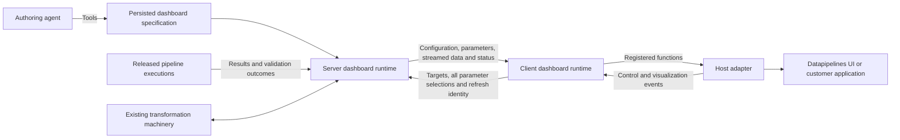

# Draft: Dashboard authoring and rendering for Datapipelines

**Status:** discussion draft for review; not a normative contract or implementation spec.
**Date:** 2026-09-25; records the dashboard discussion of September 24–25, the owner's
corrections of September 26–28 (D1–D49, R1–R28) and the runtime revision of September 28.
**Rulings D50–D59 (2026-09-28, evening):** the ten open decisions of the review are closed; §10.2 records each answer.
**Deduplicated 2026-09-28** by the orchestrator: every ruling is stated ONCE, in the table
that owns it (§2), and the sections below elaborate without restating; the review's verified
facts, open decisions and gaps are §10–§11. The pre-deduplication text (2,088 lines) is
preserved in the private store (`notes/design/2026-09-25-dashboard-draft-ORIGINAL-before-dedup.md`).
**Related issue:** [#10 — Build dashboards over pipeline results](https://github.com/msabiransari/datapipelines/issues/10).
**Evidence:** the owner's account of a working predecessor, repository source inspection
(re-verified against `main` at `a6eda076` on 2026-09-28, §10), and official library
documentation. No dashboard prototype, library benchmark or new test run was performed.
Existing code is not evidence that dashboards already ship.
**Distribution:** contributor design material under `docs/superpowers/specs/`, outside the
product documentation packaging allowlist.

Owner decisions, existing implementation evidence and proposals are distinguished throughout.
This document does not amend current execution, authorization or versioning contracts.
GitHub Issues and the Roadmap project remain authoritative for delivery status.

**Design process ruling (2026-09-27):** define the complete requirements of each component
before assembling the implementation plan. Do not substitute a reduced "first implementation"
for an unresolved product decision. Explicit owner deferrals (user-specific layout overrides,
R25–R28) remain in effect; other scope reductions require an actual decision.

## 0. How to read this document

| Kind of statement | Where it lives | Authority |
|---|---|---|
| Owner decision `Dn` | §2 table | Ruling — not reopened below without saying so |
| Owner runtime ruling `Rn` | §2.2 table | Ruling |
| Elaboration of a ruling | §3–§9, each citing its `Dn`/`Rn` once | Explains; adds no new rule |
| Proposal | marked **Proposal** | For review |
| Verified fact about the tree | §10.1 | Checked 2026-09-28 against `a6eda076` |
| Open decision | §10.2 | Needs the owner before a brief is written |
| Gap | §11 | Missing design that a lane would otherwise invent |

## 1. Intent and precedent

The product should let an agent author a dashboard over released Datapipelines pipelines,
save it as a declarative specification, and render it both inside Datapipelines and inside a
customer's application. The host controls its rendering technology and styling.

The owner built this architecture before, in another product: the agent inspected API
responses, proposed charts and authored the dashboard through tools; the persisted dashboard
held API references, chart configurations, transformations with tests, parameters and layout;
a server runtime called the APIs concurrently, transformed results and streamed chart results
over SSE as they became ready; a pure JavaScript client SDK loaded configuration, initialised
layout and controls, rendered empty charts, requested data and dispatched streamed results;
host adapters (amCharts v4, GridStack — historical choices, not selections here) implemented
chart, layout, parameter and styling behaviour; each refresh had a request ID and old responses
were discarded; chart panes conveyed loading and failure through their border or an in-pane
message; a React tool and an Angular host rendered the same dashboard through adapters.

The aim is to adapt that proven separation, reusing the numerical and transformation
foundations Datapipelines already has rather than rebuilding dashboard-specific engines.

## 2. Owner decisions and boundaries

| ID | Decision |
|---|---|
| D1 | Dashboard sources are **released pipeline artifacts pinned by release number**. A referenced pipeline definition does not change underneath the dashboard. A pin fixes the executable definition, not its future query results; historical reproduction needs retained execution data as well. |
| D2 | Data engineers and pipelines own numerical correctness, reconciliation and business calculations. The dashboard presents their results and keeps pipeline validation outcomes in the loop without inventing another business-validation system. |
| D3 | Dashboard and visualization authoring is **exclusively through MCP**: inspect available results and metadata, recommend visualizations, agree with the user, then create/update through tools. No authoring editor in the app; viewing, preview and debugging are app capabilities. User-specific layout editing/saving is deferred (D32). |
| D4 | Chart configurations target the host's actual library (an ECharts host receives ECharts configurations). **No common chart language, cross-library translation layer, or renderer-independent chart specification.** |
| D5 | The `datapipelines-dashboard` client runtime owns communication with the server, refresh handling, state and dispatch. The adapter supplies concrete functions the runtime invokes. |
| D6 | Adapter responsibilities: registrations, parameter and action-control rendering/events, visualization rendering/events, layout and host styling integration. |
| D7 | Visualizations and pipelines are **many-to-many**. |
| D8 | Refresh request IDs and discarding old responses are required, inherited from the predecessor; panes convey their runtime state. D39 settles latest-wins per targeted visualization. |
| D9 | Reuse the transformer implementation and its validation machinery: transformations adapt data to the renderer's shape; their tests remain part of authoring validation. |
| D10 | Datapipelines itself supports viewing dashboards in its UI. |
| D11 | Extend the host theme contract with semantic palettes, stable category colours, typography, density and accessibility. |
| D12 | **Plotly.js is the preferred chart renderer for Datapipelines** (superseding Vega-Lite). Native host-library configurations remain the rule; exact versions, packaging and report export remain to be selected. |
| D13 | SVG and HTML content for what the chart renderer cannot express; their authoring and execution contracts still need design (§7.3). |
| D14 | **Visualization** is the general display-object term: charts, KPI widgets, tables, SVG and other supported content. |
| D15 | Every dashboard object has a name unique across the entire dashboard and an explicit object type in its configuration. Groups do not introduce name scopes. |
| D16 | Support a dashboard of one visualization as well as dashboards with many parameters, visualizations and groups containing parameters, visualizations and action controls. |
| D17 | An action is a configured object, separate from the control that invokes it. A group's action submits the names of the group's target visualizations and **all dashboard parameter values/selections**. (D57: the visualization names are saved on the action explicitly.) |
| D18 | A refresh request carries targets and parameter values. Object-directed events, SSE results included, carry the object's name and type. (The empty-list shorthand for "every visualization" is superseded by D55's `scope` field.) |
| D19 | **A single chart embedded in any host screen is a first-class use case.** One embedding component and adapter contract serves that case and complex grouped dashboards without a full page, toolbar or unnecessary controls. |
| D20 | The dashboard server receives parameters from the separate parameter engine and may override hide/show and enable/disable for some or all parameters before sending them to the client; with no override, the engine's state. Hidden/disabled governs control interaction, not enforcement of a saved value. |
| D21 | Deliver **concrete server and client runtimes**, including error, warning, empty/no-display and abort handling; a contract document alone is insufficient. |
| D22 | The adapter contract is a central product capability: hosts register visualization lifecycle and status handlers — loading, render completion, warnings, errors, no-display, aborts (§5.4). |
| D23 | The client reads and submits **every parameter's current selected value at submission time**, hidden/disabled included and values changed by host components or client code included; it never restores server-served values. Server-side outgoing-value overrides apply before pipeline execution; both override stages may be absent (§4.4). |
| D24 | Three surfaces: MCP, the Datapipelines app, and external hosts. The app is a first-party viewing/debugging surface with execution events and exceptions, not merely an external host example. |
| D25 | Datapipelines and external hosts use the same presentation tokens with matching visual experience as the objective. Layout describes placement and sizing independently of a layout library; a host may use GridStack or another. This implementation renders the system layout only. |
| D26 | The runtime invokes pipelines in parallel and retains completed results in memory for reuse. Each transformer declares its source-result dependencies and runs when **all** are ready; its output is delivered by SSE with the target visualization identity. |
| D27 | Audit/event emission is **fire-and-forget** for dashboard, direct API and scheduled activity: no acknowledgment wait, no database transaction for capture. Emission failure is logged and the business operation continues; an independent background service owns delivery, retries and batched persistence. Durability is the objective; returning before durable capture cannot guarantee zero loss on process crash (§5.9). |
| D28 | Production failures leave correlated diagnostic evidence; organizations get a supported log export. Structured logging, diagnostic context, export delivery and tenant isolation are defined alongside durable audit capture (§5.10). |
| D29 | A separate module `visualization`; its responsibilities, dependency edges and integration contracts are specified before implementation. |
| D30 | Individual visualizations are stored separately as reusable artifacts, like templates; dashboards reference them and a shared visualization appears under each dashboard that uses it — a relationship, never a copy. |
| D31 | Dashboards and reusable visualizations adopt the existing draft/release lifecycle: MCP authors drafts; authorized app users preview/debug drafts; normal viewing uses releases. Pipeline, parameter-set and transformer dependencies are pinned to releases. |
| D32 | Only the system default layout in this implementation. User-specific layouts are deferred; the future model overlays a user's layout on the system layout. No user-layout storage, APIs or UI now. |
| D33 | A visualization is **input-bound**: it owns renderer/configuration, presentation defaults, named input contracts and transformer bindings; it has no fixed pipeline reference. The dashboard owns pipeline references, parameter bindings and the mapping of pipeline results to visualization inputs. |
| D34 | Save static-data tests for individual visualizations and assert their rendering with Playwright, independent of live pipelines; store the results. Transformer tests stay with transformers. Release checks the candidate's saved green results AND the server's mechanical visualization test (D56). |
| D35 | Representative visualization-test screenshots in PostgreSQL `bytea`: one image for the draft's latest completed run (replaced on each run) and one with each retained released version's qualifying results; bound to the exact content, run and fixture; size-limited; loaded separately from result lists. A screenshot is review evidence, not proof of execution. (Stands; D56 (a).) |
| D36 | Readable fully qualified names for authored artifact references, accepting the rename restriction. Names in saved definitions; UUIDs for transport and database identity (§4.2). |
| D37 | A failed source puts its dependent visualizations into an error state while unrelated visualizations continue. A multi-input transformer runs only after all inputs succeed; a failed source is never an empty input and never leaves a transformer waiting indefinitely. |
| D38 | Dashboard sources have **read-only business access**: temporary staging and audit/execution bookkeeping allowed; external business-data writes and external actions ineligible, transitively through child pipelines. A product contract, not a temporary restriction. |
| D39 | Each dashboard refresh has an ID returned in its events; the client compares it with the latest refresh ID **per targeted visualization**. Overlapping refreshes: latest wins per visualization; unrelated targets stay independent; a full refresh supersedes prior refreshes for all its targets. |
| D40 | A dashboard uses **at most one released parameter set**, pinned. Groups arrange its controls but create no evaluation scopes; the engine evaluates the set as a whole and the dashboard binds its values into any number of source invocations. A dashboard without parameters references no set. |
| D41 | **Explicit parameter-to-group scope:** changing a parameter makes every declared group's visualizations stale; an unscoped parameter affects all visualizations; a shared parameter affects every consuming group regardless of control placement. A parent change refreshes the parameter set before publishing stale state. Parameter changes execute sources only through a configured action. Stale state is presented through the shared presentation contract (a grey border is an example, not prescribed CSS). |
| D42 | An **explicit** action is a button press; an **automatic** action is an authored binding to a committed change of a non-parent control. Parent controls cannot bind actions. No action is invoked while a parameter-set refresh is pending. Submission carries the full parameter set and explicit visualization targets; only their required source work executes. |
| D43 | External applications use **keys** for dashboard access; all users of one key share its permitted data; the host decides which of its users may access. The secret stays on a trusted server. Proxy versus restricted browser-session exchange, and the key kind/bindings, remain under discussion (§5.5.1, §10.2). |
| D44 | **Reset** undoes unsubmitted edits only, preserves pre-existing stale/error states and never silently reruns visualizations. Restoring a shared parameter reconciles every affected group. Not cancellation, not execution rollback (§5.8). |
| D45 | On connection loss: retain displayed content, show the interruption, offer explicit Retry with a new refresh ID. No silent restart, no promised stream replay (§5.3). |
| D46 | Authored HTML/SVG is purely visual and contains no JavaScript; the markup/binding validation contract enforces it (§7.3). |
| D47 | Groups are dashboard-owned containers; nesting is visual composition only — no nested parameter sets, evaluation scopes or name scopes. |
| D48 | Dashboard release follows the existing pipeline/template lifecycle; rendering evidence is the agreed visualization tests, not a new release workflow. |
| D49 | The app has a **Dashboards** menu whose hierarchy derives from slash-separated names (`demo/trade/trade-dashboard` under `demo` → `trade` → `trade-dashboard`). Clicking a dashboard renders it through the same runtime/host contract as external applications, with a pane below showing execution events like pipelines. Authoring stays MCP-only (§3.2; the menu's shape is D58). |
| D50 | **Authority (2026-09-28).** One permission, `dashboard.execute`, on the `/api/v1/dashboards/...` family. Holding it authorizes the WHOLE refresh — source execution, parameter-set evaluation and transform evaluation run as the dashboard's delegated act, the published-endpoint model — so the viewer needs no `pipeline.execute` or `template.evaluate` of their own. Viewer, author, workspace admin and super admin hold it; the promoter holds it lensed (the `pipeline.read` rule). |
| D51 | **Key kind.** A fourth API-key kind `dashboard`, bound to dashboard names the way `endpoint` keys bind to published paths: hierarchical, workspace-confined, unbound means unservable; presented by the host's backend (§5.5.1). |
| D52 | **Executions.** A refresh's pipeline executions carry a new trigger `DASHBOARD`. They appear in the Executions list like every other trigger (API included) AND in the dashboard's events pane, which links to each execution by id — a refresh record references its executions; nothing is duplicated. |
| D53 | **Admission.** Dashboard-triggered executions are exempt from the per-user concurrency cap; they count against the per-instance cap, and a refresh reserves its N slots from a dashboard-specific bound so a large dashboard cannot starve the executor. |
| D54 | **Result size.** A byte cap per source result and a byte cap per refresh on the results held in memory for transformers; a source over either cap fails that refresh with a named refusal. Charts consume aggregates, so defaults are small (a few megabytes per source); the numbers are the spec's. |
| D55 | **Refresh scope.** A refresh and a saved action carry `scope: all` (no targets) or `scope: targets` with a non-empty `targets` list; an empty, missing or malformed list under `targets` is a validation error. Supersedes R11/D18's empty-list shorthand. |
| D56 | **Release gate (revised the same evening).** Two layers. (a) At authoring, the agent validates each visualization VISUALLY with Playwright against the authorized preview over the saved fixtures and submits per-case verdicts plus one representative screenshot; Datapipelines stores them bound to the exact candidate content (D34, D35 stand). (b) At release, FAST and server-run: every saved case is green for the exact candidate content (identity checked atomically), AND the server's mechanical visualization test passes — the renderer configuration validated against the renderer's published schema (Plotly's plot-schema, offline), the fixture's transformed output bound to every data reference the configuration makes, and, once a headless browser is available to the server (D59's export process), a rendered-state check per fixture (rendered event fired, expected trace count, no console errors). The mechanical test is about the VISUALIZATION, not a second transformer suite. A release with a missing, stale or red case, or a failing mechanical test, is refused naming the visualization, case and reason. |
| D57 | **Action targets.** The saved action carries the explicit list of its target visualizations; the authoring tool expands a group into that list at save time. |
| D58 | **The menu.** The landing item "Dashboard" is renamed **Home**; a new parent item **Dashboards** expands inside the sidebar into the hierarchy of existing dashboards by folder name (lazy-loaded and collapsible for large workspaces); no separate explorer pane. |
| D59 | **Reports.** §8 is an informative note, not part of this spec. Its one constraint on the dashboard design: the chart library must have a server-side export path (a node or Python process producing SVG/images) — Plotly has one. |
| D60 | **Permission families.** `dashboard.*` and `visualization.*` mirror `parameter_set.*` row for row — read, create, update, version.manage, delete, import, release, switch_version — with the same role cells; plus `dashboard.execute` (D50). |
| D61 | **Promotion and cascade.** Promotion order templates → parameter sets → pipelines → visualizations → dashboards; the id-taken rule (C29) for both new kinds. Releasing a dashboard releases its pinned visualization drafts under the same consent flag pipelines use for templates. D56's fixture gate runs at a VISUALIZATION's release; a dashboard's release checks its own bindings (sources pass the read-only rule, parameters bind, inputs map, pinned visualizations released). |
| D62 | **Order of work.** #266 (audit and event batching, with the ordered per-execution queue) lands before the dashboard runtime lane. |
| D63 | **Renderer bundles (revised 2026-09-28).** Plotly 4.1.1 in two self-contained custom bundles, never both on one page: a 2D default (scatter, bar, pie, histogram, box, heatmap — between the `basic` partial's 1.19 MB / 395 KB gzip and the `cartesian` partial's 1.50 MB / 496 KB gzip) and a 3D bundle (the six plus scatter3d, surface, mesh3d — about the `gl3d` partial's 1.75 MB / 556 KB gzip) that a page loads only when the dashboard has a 3D visualization; the server picks the bundle at config time from the trace types it validated at save. Plotly's 3D is WebGL by construction — there is no lighter 3D — so size is controlled by not shipping WebGL to 2D dashboards. Both vendored with hashes like Alpine; no partial bundle carries a `new Worker` site (measured), so `worker-src` is not expected — the browser collector measures the CSP on the lane instance. (The full `plotly.js-dist-min`, 4.8 MB / 1.47 MB gzip, is not used.) |

### 2.1 Corrections to the initial recommendations

Do not reintroduce these as requirements: dashboard authors do not re-establish metric
correctness pipelines own (they may need labels, units and intended presentation); the
transformer contract, tests and limits are existing foundations; a framework-independent SDK
does not imply portable chart configurations; request IDs, stale-response rejection and pane
states were implemented in the predecessor — specify their behaviour here without presenting
them as novel; release pinning removes the premise that an in-place pipeline edit changes a
dashboard, and rebinding to a new release is a separate operation.

### 2.2 Runtime rulings — the owner's 28 comments, 2026-09-28

| Owner item | Requirement and disposition |
|---|---|
| R1 | All parameter controls and actions are temporarily disabled during parameter-set refresh. Interaction-driven refresh happens only on committed **parent** changes; initial loading is R22. Any parameter with dependents is a parent, whatever its control type. |
| R2 | Parent controls cannot bind actions. Non-parent controls may invoke configured automatic actions; buttons invoke explicit actions. |
| R3 | Vocabulary: explicit = button press; automatic = committed control change. Neither means an implicit refresh on every event. |
| R4 | Typing and intermediate multi-selection are editing, not committed changes; no notification until commit. Commit gestures belong to the host adapter contract. |
| R5 | One parameter set may have controls distributed across the page — side areas, the top, groups. Layout owns placement. |
| R6 | Layout supports whole-parameter-set placement at `left`, `right`, `top` or `bottom`; per-control placement coexists (§7.4). |
| R7 | Visualization work does not lock parameter editing; changes make content stale while work is in progress. Track outstanding relevant work; render only current results; keep the in-progress indication while relevant work remains. |
| R8 | Bound visualization time: defaults from the longest dependency path (sequential nodes and transformer work included), with dashboard/visualization caps that cannot extend executor limits; agent-authored timeout fields; bounded queue time and completion grace (§5.7). Supersedes maximum-single-node arithmetic. |
| R9 | Required states: `ready`, `in-progress`, `error`, `abort`, `stale`, brief `success`, `no-data` (§5.4). Ready and data availability are separate. |
| R10 | Supersede older refreshes for the same visualization and discard their UI messages, using an ID echoed in every event — per target, not one global request (§5.3). |
| R11 | Superseded by D55: `scope: all` means every visualization; `scope: targets` with a non-empty list means those; an empty or malformed list is a validation error, never all. |
| R12 | Independent targeted group requests may be active concurrently; partial overlaps retain ownership only for targets not superseded. |
| R13 | A non-blocking abort operation initiates server cancellation. Client rejection of obsolete messages is immediate and independent of cancellation completion. |
| R14 | The server supplies the evaluated parameter set; the host renders it; no dependency/default/option engine runs in the host. |
| R15 | A pure-JavaScript browser runtime, loadable with a script tag, owns client execution coordination; pipeline/transform execution stays on the server. |
| R16 | Host components render and expose hooks; they do not orchestrate dashboard execution. |
| R17 | The integration contract is framework-agnostic. |
| R18 | All browser communication for config, parameters, visualization data and abort goes through the runtime; host components report events to it. |
| R19 | The runtime owns bootstrap. Recommendation: explicit `init()` after host/container/adapter registration (§5.5). |
| R20 | Angular, jQuery, React or any host integrates through the same artifact and hooks. |
| R21 | Specify required host components and hooks: async render completion, edit commitment, state display, disposal (§5.5). |
| R22 | Bootstrap order: load config (layout, references) → render placeholders → load/render parameter-set state → invoke configured initial action(s) → interaction-driven refreshes thereafter. |
| R23 | Three functional families (config, parameter set, visualization) and, with abort, **four HTTP operations** for viewing (§5.1); not a limit on MCP authoring/test/release endpoints. |
| R24 | Reset = undo selection edits made before a visualization render is submitted: restore the parameter state behind the rendered view without executing sources; explicit scope applies to restoration; unscoped means all. Command scope, mixed-snapshot reconciliation and post-submission cases remain to be specified (§5.8). |
| R25 | No chart/table actions in scope; preserve a future adapter event extension. |
| R26 | No drill-through/navigation in scope; preserve the extension point. |
| R27 | No saved selections/sharing in scope; runtime snapshots for Reset are not saved presets. |
| R28 | No inspect/export-data functionality in scope; add no controls or routes for it. |

## 3. Architecture and ownership

**Owner decision (D29):** `modules/visualization`. **Proposed boundary:** it owns
visualization/dashboard definitions, validation, persistence and domain lifecycle; REST and
MCP remain transport adapters in their existing modules; cross-aggregate integration with
pipelines, parameters and transforms follows the existing `application` boundary; the browser
SDK and renderer adapters are companion frontend artifacts, not JVM dependencies; shared
audit/observability infrastructure is reused. Not yet a frozen dependency graph.

| Component | Owns |
|---|---|
| Released pipelines | Data access, calculations, business validation, execution semantics |
| Dashboard specification | Named/typed objects, source release references, parameter bindings, native visualization configurations, transformations, groups, actions, layout, presentation metadata |
| Server dashboard runtime | Parameter state overrides, refresh targets and outgoing-value overrides, coordination of source executions and transformations, streaming of data and status per targeted visualization |
| Client dashboard runtime | Server calls, refresh identity, lifecycle/state, invocation of registered host implementations |
| Host adapter | Concrete rendering, event wiring, layout and styling with the host's libraries |
| Datapipelines UI | First-party viewing, preview and integrated debugging; no authoring editor |



### 3.1 One embedding contract, from a single chart to a complex dashboard (D19)

A host team implements a native component around the client runtime and adapter contract and
embeds a dashboard in any screen or container. One chart in a customer detail screen is a
complete dashboard: no separate route, page shell, toolbar, parameter form, action button or
visible group is required; omitting controls does not invent parameter values. Complexity
comes from the authored configuration, never from a second runtime or embedding API. An iframe
alone does not satisfy the requirement.

Contract requirements to specify: mount into a supplied container; load a selected dashboard;
register host implementations; expose readiness/status; react to size changes; dispose cleanly
on unmount; support multiple embedded instances on one screen, including two instances of the
same dashboard, each with isolated parameter state, requests and handler registrations —
instance identity distinguishes their events and host elements without rewriting saved object
names; no instance owns the host's whole page. Deliver a working Datapipelines adapter, a small
host-component example, adapter documentation, capability discovery and executable conformance
fixtures.

### 3.2 The app's Dashboards navigation and events pane (D49)

The landing item "Dashboard" becomes **Home** (D58). A **Dashboards** parent item expands, inside
the sidebar itself, into the authorized dashboard hierarchy by folder name
(`demo/trade/trade-dashboard` — the existing FQN grammar; no leading slash), lazy-loaded and
collapsible; no separate explorer pane. Selecting a
dashboard mounts its released view through the same runtime, hooks, parameter behaviour,
notifications and presentation contract external hosts use; authorized draft preview follows
the lifecycle. The name hierarchy is navigation, distinct from groups inside a dashboard.

Below the dashboard, an execution-events pane like the pipeline UI shows failures and
exceptions allowed by the viewer's diagnostic permissions, correlated by mounted instance,
refresh ID, visualization occurrence, pipeline execution and transform evaluation. Stale events
never update a visualization but stay inspectable in their historical run. Filters, retention
and the event schema reuse pipeline conventions and must be specified. The pane is not the
deferred inspect/export UI (R28); "all events" never exposes another user's runs, secrets or
unredacted internals. The first-party adapter passes the same conformance suite as external
adapters. Executions a refresh starts also appear in the Executions list (D52).

## 4. Authoring and persisted concepts

The authoring workflow (D3): discover eligible released pipelines and their contracts and
inspect sample results through existing tools → discover the host renderer and its supported
version/configuration → propose visualizations, controls, groups, actions and layout, asking
about presentation intent rather than the pipeline's engineering → author native
configurations and bindings, reusing or authoring transformations → validate bindings and
preview where the renderer is supported (visualization tests per §6) → save/release
visualizations and the dashboard through the lifecycle, with dependency validation before a
release becomes visible.

### 4.1 Persisted concepts (not frozen field names or a schema)

| Concept | Information to retain |
|---|---|
| Identity | Name, description, schema/version information |
| Object identity | Dashboard-wide unique name and explicit type for every object (D15) |
| Sources | Pipeline identity and exact released version; inputs supplied by the dashboard |
| Parameters | At most one released parameter-set reference (D40); bindings into source invocations; state overrides and outgoing-value overrides (§4.4) |
| Visualizations | References to separately stored artifacts (D30, D33); each occurrence has a dashboard-local name, type and the bindings that dashboard needs |
| Groups | Membership and layout for related visualizations, parameters and action controls (D47) |
| Actions and controls | Named actions with target references; named controls bound to actions, with presentation and event bindings (D17, D42) |
| Transformations | Reusable transform references and versions; tests/contracts stay with the transform (D9) |
| Layout | System default placement, sizing and responsive intent (D32) |
| Presentation | Titles, labels, theme-token references, formatting, interaction bindings |

**Reference model (D30/D33):** the artifact's identity is separate from its dashboard
occurrence name; the occurrence supplies placement and bindings, the artifact its reusable
definition. Each released dashboard pins the visualization release. A dashboard may reference
the same visualization release more than once under distinct occurrence names; renaming a
draft's occurrence updates all local references together; released content never changes.

**Still to specify:** binding wire schemas, release-reference wire format, dependency deletion
guards, promotion and import/export (§11.5), edit concurrency, and the relationship between a
dashboard save and already-tested transform releases — mapped to the template lifecycle's
actual services.

### 4.2 Names and identities (D36)

| Identity | Use |
|---|---|
| Artifact FQN, e.g. `finance/visualizations/monthly_revenue` | Saved definitions, dependency references, authoring and usage displays |
| Artifact UUID | Database identity and existing-style REST/MCP addressing; a name containing `/` never becomes one path segment |
| Release number | The immutable version paired with the FQN in a saved reference |
| Dashboard-local occurrence name, e.g. `revenue_chart` | Layout, action targets, input mappings, object-directed events |
| Instance and refresh IDs | Simultaneous mounts and refreshes at runtime; never a substitute for artifact or occurrence identity |

Reference shape: `{ "name": "finance/visualizations/monthly_revenue", "version": 3 }`, the
containing field naming the kind. Resolve within the authorized workspace and expected kind;
never search other workspaces or infer a tenant from a prefix; validate existence, access and
release state; authors never maintain both a UUID and a name. Reuse the artifact folder grammar
(2–10 segments, at most 200 characters, the shared validator; no leading slash) and the
immutable-name convention: a display title changes through versioned editing, an FQN never
renames in place; a replacement name is a new artifact with explicit dependent updates;
deletion/purge guards keep referenced releases; name reuse never makes an old reference resolve
to a different artifact. Consistent with REST §5 and parameter-set design P24; no name-in-path
route is introduced. The occurrence-name grammar is distinct and still to be frozen.

### 4.3 Objects, groups, actions and controls

Names identify objects across the whole dashboard; two objects cannot share a name across
groups or across types; display labels may repeat. The type is explicit in configuration and
in object-directed events, so the runtime identifies what an event concerns without a lookup;
object type and renderer identity are separate concepts.

Groups give composition and action scope only (D47); nested layout schema, depth and the
expansion of group references into explicit visualization targets are engineering details —
visual containment must never silently change parameter scope or action targets.

An action defines refresh intent and its explicit target list (D57 — the tool expands a group at
save time); its control (an Apply button) is the invoker (D17, D42). **Proposal for validation:** reject duplicate names, dangling action/control
bindings, and targets that are absent or not visualizations; under D55 an emptied list is a
validation error, so an action for a group with no visualizations is refused at save. Reject parent/action bindings at authoring and enforce the same in the
runtime.

### 4.4 Parameter state and outgoing-value overrides (D20, D23)

| Stage | Applied by | Effect |
|---|---|---|
| 1. Engine → dashboard server | Parameter engine supplies definitions, resolved values, hidden/disabled state; the server may override hide/show and enable/disable per parameter | Changes control visibility/interactivity; never changes a value |
| 2. Server → browser | The runtime hands the payload to host components, which render controls and manage editing | Hidden/disabled is the interaction mechanism; no value-preservation layer |
| 3. Browser → server | An action submits targets and every parameter's current value, hidden/disabled and client-changed values included | Never the originally served values |
| 4. Server → pipelines | Selections validated through the engine; pipeline inputs bound; **outgoing-value overrides** applied; final inputs validated against the pinned release's contract | The override is authoritative for the pipeline input whatever the control showed |

Both stages are independently optional; a dashboard may configure neither, either or both.
Example: a hidden region parameter served as `EMEA` and changed by client code to `APAC` is
submitted as `APAC`; with a configured outgoing override of `AMER`, the pipeline receives
`AMER`. Overrides live in the dashboard definition, never mutate the parameter-set release,
are reapplied whenever refreshed state is sent, and never replace the engine's validation and
dependency resolution. **Proposal:** inherit / force-true / force-false per state dimension with
dashboard-wide settings and per-parameter exceptions; exact fields, precedence, outgoing-value
sources (constants, resolved server context) and scope across bindings are open.

### 4.5 Interaction policy — the one normative sequence (D41, D42, R1–R4, R7)

Parent classification is server-provided from the engine's dependency graph (§10.1: the
evaluate response already carries each parameter's `dependents`). Scope validation checks each
declared group against source bindings and dependent parameters; the invalidated set is the
union of affected scopes; a declared scope that omits a consuming group is rejected.

1. The host reports edit begin/end separately from a committed value (proposed gestures:
   Enter/blur for text; Done/Apply/closing-with-acceptance for multi-select; a cancelled edit
   reports nothing; the adapter documents its gestures). Widget-local parsing is allowed;
   parameter semantics stay server-owned.
2. A committed change snapshots all selections, advances the **parameter revision** and
   invalidates the affected occurrences (their **freshness generation** advances), so
   old-selection results cannot become current for them; previous content may stay visible;
   unaffected groups keep their request owners.
3. If the changed parameter is a parent: set parameter-refresh pending, call the parameter
   operation with the whole set, disable every parameter control and refuse every action entry
   point (user, programmatic, automatic, initial) until it settles; accept only the newest
   applicable response; apply the whole server state and overrides; publish stale state for the
   affected scope. Engine-driven updates never synthesise user-change or action events. Nothing
   refused during the pending interval is queued for later.
4. A non-parent committed change fetches nothing; it marks its scope stale and, if it carries an
   automatic action and no refresh is pending, invokes that action once; otherwise waits for a
   button.
5. An action commits any in-progress editor first (if that commit starts a parent refresh, the
   action is refused), then submits every current selection with explicit targets; only targets
   become in-progress; the server validates every value and applies outgoing overrides before
   executing; a successful current render clears staleness for those targets only; a failure
   never marks old content current. Host-originated value updates take the same path.

If server evaluation resets a selection or changes dependent state during submission, the
resolved parameter state is returned and output is never labelled as belonging to different
visible selections; the reconciliation response is to be specified without changing the
engine's standalone evaluate behaviour. Freshness (stale) and work status (in-progress, error)
are separate fields: a spinner or an error never hides that visible values belong to an
earlier selection. Source freshness (underlying data changed) is distinct from selection
staleness; a last-refreshed timestamp is useful, but nothing here detects arbitrary database
change.

### 4.6 Worked binding contract — proposal for review

Names, versions and fields are illustrative. Renderer configuration, tests and contracts belong
to the separately stored visualizations.

| Visualization release | Named inputs | Owned transformer binding |
|---|---|---|
| `finance/visualizations/monthly_revenue` v3 | `revenue` | `finance/transforms/revenue_bars` v2 |
| `finance/visualizations/revenue_table` v1 | `revenue` | `finance/transforms/revenue_table` v1 |
| `finance/visualizations/revenue_vs_target` v2 | `actual`, `target` | `finance/transforms/revenue_comparison` v4 |

```json
{
  "name": "finance/dashboards/revenue_overview",
  "parameter_set": { "name": "finance/parameters/reporting_period", "version": 1 },
  "sources": [
    { "name": "revenue_source", "pipeline": { "name": "finance/pipelines/monthly_revenue", "version": 7 },
      "parameters": { "year": { "parameter": "year" } } },
    { "name": "target_source", "pipeline": { "name": "finance/pipelines/monthly_targets", "version": 2 },
      "parameters": { "year": { "parameter": "year" } } }
  ],
  "visualizations": [
    { "name": "revenue_chart", "type": "visualization",
      "visualization": { "name": "finance/visualizations/monthly_revenue", "version": 3 },
      "inputs": { "revenue": { "source": "revenue_source" } } },
    { "name": "revenue_table", "type": "visualization",
      "visualization": { "name": "finance/visualizations/revenue_table", "version": 1 },
      "inputs": { "revenue": { "source": "revenue_source" } } },
    { "name": "comparison_chart", "type": "visualization",
      "visualization": { "name": "finance/visualizations/revenue_vs_target", "version": 2 },
      "inputs": { "actual": { "source": "revenue_source" }, "target": { "source": "target_source" } } }
  ],
  "groups": [ { "name": "overview_group", "type": "group",
                "members": ["year", "revenue_chart", "revenue_table", "comparison_chart", "refresh_button"] } ],
  "actions": [ { "name": "refresh_overview", "type": "refresh",
                 "targets": ["revenue_chart", "revenue_table", "comparison_chart"] } ],
  "action_controls": [ { "name": "refresh_button", "type": "action_control", "action": "refresh_overview" } ]
}
```

The two sources run in parallel; `revenue_source` is materialised once and feeds three
consumers; the chart and table transform as soon as it completes; the comparison waits for
both. A refresh targeting only `comparison_chart` needs both sources but makes neither of the
other two a target; a refresh of `revenue_table` alone needs no `target_source`. One eligible
result per source is assumed; selecting additional results needs an explicit output contract.
Before freezing the schema: missing/extra input-binding errors, result selection, the
local-name and type vocabularies, and the layout/action-control contract, each with executable
examples.

### 4.7 Product comparison and explicit deferrals

Power BI's apply-all slicers, Metabase's optional auto-apply, Tableau's actions and Grafana's
chained variables (documentation reviewed 2026-09-28) support the explicit-submission model
and the settle-dependents-before-submit order; they establish no feature parity claim.
Deferred by R22–R28 with their extension points preserved: chart/table interactions mapping a
selected value into named parameters; navigation/drill-through carrying parameter values;
reusable/shareable selections; inspect/export with labelled snapshots. Still to define for the
current scope: refresh-all, retrying failed targets, duplicate clicks, and whether a retry uses
current selections or the failed run's snapshot; periodic refresh, if ever wanted, must be a
configured trigger with defined behaviour during unapplied edits.

## 5. Runtime behaviour

### 5.1 The four viewing operations (R23)

| Method and route (proposal) | Contract |
|---|---|
| `GET /api/v1/dashboards/{id}/runtime/config` | Select an authorized revision; return resolved layout, parameter-set reference, visualization references and the renderer metadata needed to mount placeholders; return a configuration identity used by the other operations |
| `POST /api/v1/dashboards/{id}/runtime/parameters` | Configuration identity plus selections/initialization intent; return the complete evaluated parameter state and effective overrides; called at bootstrap and on committed parent changes |
| `POST /api/v1/dashboards/{id}/runtime/visualizations` | Configuration identity, fresh refresh ID, parameter revision, all selections, `scope` and (for `scope: targets`) the `targets` list; one multiplexed SSE stream with source diagnostics and object outcomes for that refresh |
| `POST /api/v1/dashboards/{id}/runtime/refreshes/{refresh_id}/abort` | Authorize and initiate cancellation of that refresh; `202 Accepted` without waiting; idempotent; never cancels an unspecified "last request" |

D55: `scope: all` refreshes every visualization; `scope: targets` requires a non-empty list;
missing, null, empty, malformed, duplicate or unknown targets are validation errors. IDs grant nothing; each
refresh is bound to its workspace, viewer, configuration and instance. Every operation sits behind `dashboard.execute` (D50); error codes, DTOs and abort-before-start
races need the implementation contract and the repository's matrix/doc/role-walk rows. Transport: `fetch` POST with a streamed SSE response (native
`EventSource` cannot send a JSON body), bounded buffering, one stream per refresh — reuse the
existing execution stream's framing (§10.1). Host components never call these or the
underlying services.

### 5.2 Sources, eligibility and many-to-many dependencies (D7, D26, D37, D38)

Eligibility is validated transitively at dashboard validation/release and enforced at run
time; never trusted from a browser flag, a label or the first SQL keyword. §10.1: the endpoints'
`ReadOnlyPipelineRule` already implements exactly this rule — reuse it. Rejection names the
offending source without executing it; the restriction is a dashboard-execution contract, not a
prohibition elsewhere.

A source invocation is distinct from pipeline identity: two invocations of one release with
different final inputs are distinct; identical invocations (compared **after** outgoing
overrides) within an authorized refresh are shared. A targeted refresh resolves every source its
targets need, shared ones included, without adding other visualizations to the targets. The
runtime invokes independent pipelines in parallel through the application's execution services
(no HTTP back into the server) under the dashboard's delegated authority (D50), keeps completed results in memory, schedules each dependent
transformer once when all its inputs are ready, and streams each transformer's output to its
target. Source failure: dependents error, unrelated visualizations continue, no substituted
empty input, every affected occurrence leaves its waiting state, the refresh summary
distinguishes mixed outcomes from success; transport-wide failures, cancellation and loss of
authorization are separate. Transformations reshape for presentation and must not become a
second home for business calculations.

**Implementation boundary:** `DirectResultSink` bypasses Redis for internal composition and
yields lazy rows over an open cursor that must be consumed inside the callback; dashboard use
needs an explicit integration that retains complete typed results in memory under D54's
per-source and per-refresh byte caps (§11.2 has the executor's numbers), does not disable
execution history or Redis event logging, and specifies ownership and release after the last
consumer, cancellation cleanup, and that in-memory results are neither crash recovery nor a
cross-refresh cache. Admission follows D53; executions carry the `DASHBOARD` trigger (D52). Result paging/completeness, payload limits, concurrency, timeouts and any caching
(keyed by parameters and authorization, never by release alone) still need decisions.

### 5.3 Freshness, request ownership, abort and connection loss (D8, D39, D45, R10, R12, R13)

The client generates a UUID `refresh_id` before submission, stamps the targeted occurrences
and sends it; the server echoes it through every event of that refresh. The client keeps the
latest refresh ID **per occurrence per mounted instance** and accepts an object's event — data,
status, warning, error, abort, completion — only when its ID matches; dashboard-level
completion belongs to its run and cannot clear an occurrence owned by a newer run. Refresh IDs
are distinct from pipeline execution IDs.

Ownership registry: per refresh, its original targets, current owned targets, parameter
snapshot/revision, deadline and terminal bookkeeping; per instance and occurrence, the latest
owner. New requests replace ownership only for their targets; `scope: all` expands against the loaded
dashboard. R1 for A/B then R2 for B/C leaves R1 owning A and R2 owning B/C — R1 is not aborted
while A needs it, and R1's UI work for B is discarded; a full refresh supersedes every owner.
Once a run owns no targets, detach its UI work and initiate its server abort without waiting;
shared server work stops only when no still-needed target consumes it. A committed parameter
change (§4.5 step 2) invalidates affected occurrences even without a new refresh. Refresh
identity passes through asynchronous adapter work too: a render started for R1 must not publish
late DOM changes or mark R2 complete; disposal invalidates the instance and its pending
callbacks. "Keep only the last request" means latest ownership per visualization, not one
process-wide request or immediate driver termination.

Abort is an authenticated intent keyed by the explicit refresh ID: local ownership and
callbacks are invalidated immediately, the abort is sent asynchronously, transport failure is
recorded separately, and acknowledgment means cancellation was requested, not that work
stopped; it must reach the executing instance in multi-instance deployments, release shared
work only when safe, and handle abort-before-registration and repeated aborts without
cancelling a newer run. Connection loss (D45): retain content, report the interruption for
still-pending targets, offer Retry with a new refresh ID through the normal action gate using
current committed selections and an explicit target set; completed targets stay completed;
server cleanup maps to the existing disconnect contract (§10.1: no resumption, `Last-Event-Id`
ignored, events replayable for one hour from the events route).

### 5.4 States, host handlers and notifications (R9, D22, D21)

| State | Meaning |
|---|---|
| `ready` | Component loaded and resting; data availability carried separately |
| `in-progress` | The occurrence's current relevant request/render is outstanding; a stale flag accompanies old visible content |
| `error` | Source/transform/render failure or a classified transport/deadline failure, with stage and reason; retained data never becomes current |
| `abort` | Current work cancelled; superseding an old request never overwrites a newer request's state |
| `stale` | Parameter changes invalidated the content and no relevant work takes precedence |
| `success` | A brief indication after actual render completion, then `ready`; bounded duration; only the current request starts or ends it |
| `no-data` | Execution succeeded but nothing renderable exists; a zero KPI or a renderable empty state is not `no-data` |

Precedence: work status and freshness are separate fields with one primary display state;
in-progress stays visible while relevant work remains even when stale; on completion show
success/ready or no-data only if still current, else stale; failures become error with a
reason; timeouts are errors (consistent with the pipeline timeout contract); user/disposal
cancellation is abort; a missing terminal frame or failed render callback times out or errors
rather than spinning forever; retired requests are bookkept internally without dispatching to
the host.

Host operations and notifications (names illustrative): initialize/mount; stale; in progress;
data ready / render requested; rendered (the adapter's asynchronous acknowledgment, carrying
the request identity); warning (coexists with data, never becomes failure or empty); no data;
no display / blocked (with a reason — never a blank pane); error (scope and structured
diagnostics); abort / cancelled (locally requested vs server confirmed); resize / dispose.
Callbacks carry instance identity, object name/type, refresh identity, structured state and
diagnostics; dashboard-level failures reach a host-level handler. Server completion, data
delivery and host render completion are three separate events, and only the renderer
acknowledges the last. Robustness: isolate a handler's failure from its siblings and report it
through a runtime-owned path without re-invoking the failed handler; detect missing required
handlers at registration; bound render completion with an explicit fallback; on disposal remove
listeners, close instance-owned streams and stop dispatching.

Notifications (owner requirement): structured, instance-scoped, with operation identity,
affected scope, severity, stable reason code, safe user text, retryability and recovery intents;
never raw SQL, secrets, stack traces or internal messages (debugging uses a correlation
reference and the diagnostics surface). The host must visibly and accessibly communicate:
parameter refresh in progress and why controls are unavailable; timeout, network/server,
validation and host-render failures with what remains usable and a recovery action; why
submission stays blocked after the lock releases; successful recovery. Blocking errors and
their recovery controls stay discoverable until resolved (a disappearing toast is
insufficient); no colour-only signals; no focus stealing; deduplicated per outcome; old attempts
never replace a newer attempt's message. Conformance: initialization rejects adapters missing
status, notification or recovery capabilities; browser conformance tests verify visible,
accessible behaviour including timeout recovery — a no-op callback is not conformant.

### 5.5 The script-tag runtime, bootstrap and host hooks (R14–R22, D5, D6)

A versioned pure-JavaScript asset, loadable with `<script src>`, no framework dependency,
build step or CDN assumption, vendored by the host. Script evaluation registers the library
only; the host calls `init` once container and adapter are ready with server location,
dashboard identity/release selector, container, adapter and an approved authentication
provider/transport context; it returns an instance handle immediately with a readiness promise
and lifecycle methods (`ready`, dispose, resize, authorized programmatic actions/abort). All
maps, requests and callbacks are namespaced to the instance; re-initialising an owned container
is refused or explicitly replaced.

Bootstrap barrier (R22): validate adapter capabilities and fetch the configuration (fail before
execution if a renderer is unsupported) → ask the host to create layout and placeholders and
await it → fetch the parameter state and render controls in their slots with overrides applied,
awaiting the host (no parameter set = explicit no-op) → invoke configured initial actions only
once ready and parameter state is valid. Changing dashboard identity/release requires an
explicit reload/disposal policy.

| Hook | Host | Runtime |
|---|---|---|
| Mount layout | Create containers/slots from the system layout; report completion and resize | Supply validated layout and placement identities |
| Mount visualization | Create each placeholder and renderer instance | Resolve configuration; verify capabilities; own lifecycle |
| Render parameter state | Render/update the full server state without synthetic user changes | Fetch/evaluate; distribute state; gate actions |
| Read committed selections | Return every current value, hidden/disabled included; expose edit-in-progress separately | Snapshot before submission; never restore originals |
| Report edit/commit/action | Report editing, committed values and action IDs; commit before an action | Classify parent/leaf from server metadata; validate; invoke allowed actions |
| Render visualization data | Apply native data; report completion, no-data or failure asynchronously; respect identity/abort | Invoke only for current data; enforce deadlines and freshness |
| Render status | Show every required state, the stale flag, parameter busy/invalid state and scoped diagnostics accessibly | Own transitions, precedence and success timers |
| Present notification and recovery | Display scoped messages and recovery controls; report recovery intent | Emit, correlate and deduplicate notifications; run authorized recovery; enforce lock deadlines |
| Dispose | Unregister listeners; release renderer/DOM resources | Abort/detach requests; clear timers; invalidate callbacks |

Still required: external host authentication and token renewal, CORS/CSRF behaviour,
credential scope, script/renderer version compatibility, browser support, capability discovery;
the exact API's promise rejection, cancellation and render-timeout semantics; conformance
examples for a plain host and framework hosts with asynchronous mounting.

#### 5.5.1 External application keys and transport (D43) — decision in progress

A reusable secret stays in the application's backend, never in initialization, browser
storage, assets or request headers; HTTPS does not hide a credential from the browser holding
it; application authentication precedes any use of its key.

| Arrangement | Path | Trade-off |
|---|---|---|
| Backend proxy — recommended for the stated key model | Browser runtime → authenticated application backend → Datapipelines, the backend attaching its key | The secret never reaches the browser; the application runs streaming proxy routes for the four operations, preserving SSE, ownership, timeouts and cancellation |
| Restricted browser-session exchange — alternative, not approved | Backend obtains a short-lived dashboard credential; the browser calls Datapipelines directly | Avoids relaying streams; adds credential exchange, constrained authority, expiry/renewal/revocation and CORS; the browser credential is visible by design |

The host backend is a security boundary, not a second engine: the JavaScript runtime still
initiates every call and owns state; proxy routes authorize dashboard access and run ownership,
stream rather than buffer, never become an unrestricted relay, and never forward
browser-supplied authority as server identity. §10.1 confirms no existing key kind reaches the
proposed routes; D51 adds the `dashboard` kind. Equal data access under one key does not merge
sessions: selections, callbacks, mounted instances and refresh ownership stay independent, and
one user's abort cannot cancel another's run; ownership is server-validated, never trusted from
a supplied refresh ID; audit attributes the call to the key principal, with optional host user
correlation as diagnostics only. The first-party app keeps its session credential.

### 5.6 Action gating and the parameter-refresh lock (R1, D42)

The runtime owns a parameter-ready gate distinct from visualization progress: actions —
button, programmatic, automatic, initial — are refused while a parameter refresh is pending or
the state is invalid, and never queued. Editing is permitted during visualization progress
(R7); the host keeps edit buffers and emits one committed change per commit gesture, preventing
duplicate commits (Enter then blur) while distinct submissions get distinct refresh IDs; whether
rapid identical presses coalesce is a remaining policy. During the pending interval every
parameter control is disabled and programmatic mutations are refused; the accepted full server
state is applied before the gate releases, and releasing never enables a control the engine or
a dashboard override keeps disabled. On refresh failure the temporary lock releases, the error
is exposed, and submission stays blocked until the state is valid again.

**Lock deadline (owner requirement):** the lock has a finite timeout independent of any HTTP
response or host callback, covering setup, network/server evaluation, response processing and
the host's application of state; initial loading uses the same bound. An absolute deadline
starts when the lock is acquired, with a finite configured default and platform cap that
zero/unlimited/invalid values cannot disable; retries within an attempt do not restart it. Each
attempt owns its lock, timer and response generation and terminates exactly once; cleanup never
waits for logging, notification rendering or server cancellation; an old timer cannot release a
newer attempt's lock. On expiry: invalidate the attempt's callbacks, initiate best-effort
cancellation, release the lock, publish a timeout outcome; a late response changes nothing;
recheck the deadline on callback acceptance and browser resume. Editability is restored per
engine/dashboard rules, submission stays blocked while the attempted state is unresolved, and
retained charts stay truthfully stale. An explicit Retry re-evaluates with the complete current
selections under a new attempt; nothing is replayed. A rejected or non-completing parameter
render hook follows the same bounded path and surfaces a recoverable host-render failure.

### 5.7 Timeouts (R8)

Dashboard and visualization definitions carry optional agent-authored timeout fields with
computed defaults and platform caps — versioned execution-contract fields. The server resolves
and enforces deadlines and returns effective budgets so the runtime can bound transport and
render; enforcement never depends on a browser timer. Defaults derive from the longest
dependency path — sequential pipeline nodes and transformer work — plus bounded queue waiting,
transport and render grace, using resolved wall-clock node deadlines rather than statement
timeouts (the executor's node, statement and execution tiers and their numbers are in §11.2).
Precedence: the platform hard limit caps the run; an explicit dashboard timeout caps the
refresh; a visualization's explicit or derived timeout caps that occurrence; the earliest
applicable deadline wins and existing limits still apply; a visualization cannot extend the
dashboard or the executor. Measure from admission through the completion boundary; queue time
never restarts the clock. One visualization timing out becomes `error` with its stage and
detaches from shared work; dashboard expiry terminates remaining targets with best-effort
cancellation; timeout and abort stay distinct; effective values and their sources appear in
diagnostics. No numerical defaults are selected here.

### 5.8 Reset (R24, D44)

Reset restores the parameter state behind the rendered view after unsubmitted edits, without
executing sources or emitting actions: a group rendered January, the user selects February but
does not submit, Reset restores January and clears that staleness while the January
visualization stays; for a parent, restoration includes dependent selections and the coherent
server-provided state. **Bookkeeping proposal:** retain the applied selection snapshot and
evaluated state behind each displayed result plus the state before the first unsubmitted edit
(later edits never replace that baseline); restore the applicable baseline; remove only the
staleness the undone edits introduced; preserve pre-existing stale/error; matching content
returns to `ready` (or `no-data`) without a new success event; invalidate obsolete parameter
responses and render callbacks. Open: whether Reset is dashboard-wide or per group; which
snapshot a shared parameter restores when groups show different snapshots (never make both
current by picking one; the earlier "latest fully successful refresh" proposal is not accepted);
Reset is disabled while a refresh is pending and before a rendered baseline exists and cannot
undo a submitted run; baseline advancement for independently completed targets and partial
failures; whether later edits may be reset while an earlier run is active; restoration of a
snapshot invalid under current server options (refuse or reconcile, never silently mark old
content current).

### 5.9 Audit and execution-event batching (D27) — tracked as #266

§10.1: `AuditLogger.log` is a blocking JDBC insert and `WebEventEmitter.emit` streams the
event then awaits its persistence — deliberately, to preserve per-execution event order; the
launcher persists every execution's RUNNING row before its first event, and the scheduler's
adapter waits on that barrier. Batching must preserve that barrier and the event foreign-key
ordering; the audit log, durable execution events, execution lifecycle rows and the Redis
replay log stay distinct records.

**Contract:** snapshot the immutable event and context → submit to an application-owned
background delivery service → return immediately. The service owns transport, durable
buffering, retries and eventual batched writes (Spring JDBC `batchUpdate`, separately
evaluated Redis pipelining) independently of the request's coroutine, connection and
transaction; cancellation or rollback never cancels submitted delivery; a full or unavailable
queue is logged, never blocking the producer; a later failure belongs to the background service
and never propagates into a completed request; the fallback logger never feeds the failing
sink. Because the current emitter awaits persistence for ORDER, the replacement must be a
bounded, ordered per-execution queue with one consumer. Guarantee boundary: request termination
and process termination differ — a crash before durable capture can lose an emitted event, and
this draft records that limit rather than the owner's acceptance of arbitrary loss; an in-memory
queue alone does not meet the recovery objective. Record attempted/committed/failed/
indeterminate outcomes accurately; a crash between a business commit and outcome capture needs
reconciliation, never an invented event; the scheduler's start barrier is execution control,
changed only by an explicit lifecycle design. Specify admission bounds, stable event IDs,
per-execution ordering, retry deduplication, terminal visibility, poison events,
shutdown/restart recovery, loss monitoring, origin/correlation through child executions; live
SSE never waits for history flushes. Acceptance: cancel after submission, roll back, interrupt
after durable capture, restart before bookkeeping completes; verify completion, recovery and no
duplicate history; report the pre-capture loss window honestly; verify emission failures leave
the business outcome unchanged; include storage outages, full queues and a failing record in a
batch; compare throughput and p95/p99 against the current writer.

### 5.10 Production diagnostics and organization export (D28) — tracked as #270

§10.1: `ApiExceptionHandler` and `CorrelationIdFilter` exist; `application.yml` declares
`format: json` and `tracing:`; no JSON encoder, OTLP exporter or consumer of those settings is
in the tree. **Proposal:** structured JSON logs plus OpenTelemetry correlation and a supported
Collector path; snapshot request/correlation ID, workspace, actor, execution and parent,
schedule/job, dashboard/refresh, visualization/transform identities before asynchronous
hand-offs (request-bound MDC is insufficient after the request ends); include timestamps, stage,
outcome code and redacted cause; no execution ID required for request-level failures; browser
render failures need an explicit client reporting contract. Keep audit/execution records
distinct from operational logs but joinable by stable IDs; required failure evidence uses the
§5.9 delivery path and is never sampled away; define ordinary retention separately. A Collector
with persistent `file_storage` queues resumes after restart but does not make the application's
pre-Collector hand-off durable. Organization export: authorized workspace records only,
server-established routing, redaction, protected destination credentials; destination
validation, roles, retention, delivery lag, replay/deduplication, outage recovery, capacity
isolation between organizations, and a fallback diagnostic path independent of the failed
writer. No exporter or broker is selected.

### 5.11 Concrete runtime delivery (D21)

A working server runtime, a usable pure-JavaScript SDK and a concrete Datapipelines adapter,
reviewed together; hosts never recreate configuration loading, parameter evaluation, refresh
targeting, SSE handling, stale-response rejection or failure coordination. Both runtimes define
terminal outcomes and cleanup for every requested visualization — errors, warnings, absent
data, aborts, transport disconnects — without reporting success because a stream closed; an
intentional abort ends the loading indication and is never an unexplained error. Demonstrate a
single embedded chart and a complex grouped dashboard through one runtime, then failures and
cancellation through that host component. The existing DAG executor's fail-fast rule within one
pipeline stands; failure containment between independent invocations is the dashboard's
design (§5.2).

## 6. Validation and saved visualization tests (D9, D34, D35, D48)

Existing foundation (implementation inventory, not a fresh pass/fail): `TemplateValidator`
requires transform contract/invariant/test blocks and an empty-input case and runs the suite;
`TransformTestRunner` evaluates through the bounded pool, gates output, checks invariants,
compares expected output or refusal codes and bounds evaluation and suite time; `TypeGate`
enforces row shape, nullability, wire types and numerical rules and bounds object output;
`TransformConfiguration` wires the pool, runner and evaluation service; `ScriptEngine` and
`EngineCapabilities` state the limits (JSONata can overrun within a builtin, ignores thread
interruption, has no in-process heap budget; the pool bounds admission and retains an overrun
slot). Dashboard-specific validation is integration: source eligibility, parameter bindings,
transform compatibility, renderer configuration, required bindings and layout; pipeline
failures and validation outcomes are conveyed, never reinterpreted as a successful empty
visualization.

Saved visualization tests are product functionality authored through MCP: fixtures supply the
visualization's named inputs in place of pipeline results. **The two layers (D56):** (a) at authoring the agent drives Playwright through its own browser tools against the authorized preview served by the real runtime; MCP starts the session pinned to the candidate and its saved cases and records per-case verdicts, bounded diagnostics and one representative screenshot the agent submits through an authorized upload path (its own REST route with its own cap — a tool argument cannot carry it, §11.4); the server never executes arbitrary Playwright scripts. (b) At release, fast and server-run: every saved case green for the exact candidate content (checked atomically with release so an intervening edit cannot pass on stale evidence) AND the mechanical visualization test — the renderer configuration validated against the renderer's published schema, the fixture's transformed output bound to every data reference the configuration makes, and, once the server has a headless browser, a rendered-state check per fixture. A missing, stale or red case, or a failing mechanical test, blocks the release naming the visualization, case and reason; a blocked release is fixed with the agent and re-run, never launched by release itself.

Evidence records the candidate content identity, fixture and assertion identity, pinned transformers, renderer/adapter version, the agent-reported environment (theme, fonts, viewport, locale, browser — identified as agent-reported), who submitted, timestamps, per-case verdicts and the server's mechanical outcome. Screenshots: PNG or an approved format as `bytea` in a separate evidence table, validated media type, byte and dimension limits, a server-computed digest; one image per draft's latest run (replaced) and one per retained release; the depicted case recorded; a failed run never leaves an older image labelled current. Trust boundary: an agent can submit an unrelated image and a privileged writer can alter verdict and image; the hash checks integrity, not authorship — which is why the server's mechanical test is the second layer. Rendered-state checks probe actual rendering (Plotly's plot promise/`afterplot`), never the input configuration. Custom-host
renderers need an accessible compatible preview; packaging, required profiles and preview
authentication are open. Repository acceptance must falsify the gate with a fixture the
transformer refuses, an unbound configuration reference and stale evidence for a changed
candidate.

## 7. Rendering and host presentation

### 7.1 Renderers (D4, D12, D13)

| Renderer | Status |
|---|---|
| Plotly.js | Preferred for Datapipelines; native configurations; keeps a server-side export path (D59); version, bundle and CSP posture to be settled (§11.3) |
| KPI / table | Required families; implementation and adapter bindings open |
| SVG / HTML | Owner-requested; templating/binding contract open (§7.3) |
| Host-native (e.g. ECharts) | Supported when the host uses it; author its native configuration |

The runtime supplies transformed data through registered adapter functions; native
configurations never fetch pipeline data themselves; asset-loading policy is defined separately.
Plotly's SVG/raster exports embed raster content for WebGL traces; the reporting profile must
state dimensions and export expectations. The host's renderer version must be known at
authoring; Datapipelines cannot certify an adapter it does not run — unsupported-renderer
behaviour and the preview environment for custom adapters need definition.

### 7.2 Theme contract (D11, D25)

One token contract and values for Datapipelines and hosts; native component and chart defaults
mapped and visually checked (identical tokens alone do not prove identical rendering). Tokens
cover categorical palettes, sequential and diverging scales; positive/negative/warning/neutral
meanings; **stable category-to-colour assignment** (a category keeps its colour when others
disappear under filtering — define the key and persistence scope); text, background, border,
focus and status colours; typography, spacing, density, sizing, reduced motion; light/dark,
contrast and alternatives to colour-only information. **Proposal:** evaluate the Design Tokens
Community Group format for exchange. Server rendering receives resolved values, fonts and
formatting context, never inherited host CSS. Plotly's configuration is JSON, so the adapter
must read the resolved tokens (computed CSS custom properties) into layout and traces at render.

### 7.3 HTML/SVG content (D46)

Templates describe markup and styling; transformer output supplies data; the trusted renderer
applies validated bindings and theme values; saved content cannot supply executable code.
Required enforcement: allowlisted elements, attributes, styles and resource references; safe
text/attribute binding; rejection of script elements, handler attributes, executable URL
schemes and other active embedding at authoring AND at render, including data substituted into
a template; no template expressions; no markup injection through data; the sanitizer/isolation
mechanism and asset policy need engineering design — removing `<script>` is not sufficient. SVG
as an image disables scripting but also external resources; inline SVG does not get those
guarantees — choose the context deliberately, preserving accessibility and theming.
Chart/table-driven actions and drill-through stay deferred (R25–R26).

### 7.4 System layout and parameter placement (R5, R6, D32)

```json
{ "parameter_set": { "position": "left" },
  "parameter_placements": { "year": { "region": "top" }, "region": { "group": "sales_group" } } }
```

With only `parameter_set.position`, every control sits in that region in the set's order;
per-parameter placements override (move, never duplicate); the example moves `year` to the top
and `region` into the sales group. Validation: every placement names a real parameter or group;
every visible control has one effective placement; hidden parameters keep their values without
a control; disabled controls render per state; the client submits the complete set regardless
of placement. Responsive placement follows declared rules and host rendering and never changes
bindings, evaluation or targets. Freeze breakpoints, region sizing/collapse and the nesting
schema before implementation; no GridStack instance/DOM state in the saved definition; future
user overrides compose above the system layout.

## 8. Report generation — starting point for further discussion

**Status (D59):** an informative note for a future discussion — not part of this spec, not an
engine selection, throughput guarantee or first-release scope. Agent-authored reports with
different layouts per page, with or without charts; analytics first but a generic engine;
hundreds of client reports nightly plus on-demand. Plotly supersedes Vega-Lite here too.

- **Versioned templates, deterministic execution (8.1).** The agent authors, validates and
  previews a reusable document template; production jobs fill a selected report release with
  resolved data and render without an LLM. A report definition holds released pipeline
  references and parameter bindings, transformation references, a document template with
  reusable fragments (covers, headings, metric blocks, charts with captions, tables, footers —
  no domain concepts), optional native chart specifications, versioned theme/fonts/logos/images,
  renderer identity/version and rendering profile, fixtures and rendering expectations. Initial
  recommendation: HTML/CSS templates, static Plotly chart assets, WeasyPrint for PDF —
  subject to evaluation; investigate reusing the FreeMarker foundation; do not invent a JSON
  typesetting language or a translator between engines.
- **Fixed pages and flowing sections (8.2).** Cover (one composed page), summary (fixed
  arrangement), analysis (per-section layouts), detail tables flowing across pages with
  repeated headings, repeated per-client/product/region sections, an appendix with its own
  page setup. Fixed compositions need an explicit overflow policy (fail an expectation or a
  declared continuation; never silently clip or shrink); numbering, headers/footers, breaks and
  fonts belong to the document design.
- **Acquisition and rendering as separate stages (8.3).** Schedule/request → durable job →
  released pipelines and transformations → captured inputs and pinned assets → static chart
  assets → layout and PDF → validated stored artifact → delivery. Rendering consumes a
  self-contained bundle without querying anything; retries render without re-running pipelines;
  a PDF failure never discards acquired data; the bundle is a captured set, not a cross-database
  snapshot.
- **Determinism (8.4).** Same release + captured inputs + assets + environment → same content
  and layout; fix data ordering, an explicit "as of" time, locale/timezone/formats, theme/fonts/
  images, software versions, page and chart dimensions; templates never consult the clock or
  fetch mutable URLs. Identical bytes are a separate, stronger requirement; preserve the issued
  artifact and its hash. LLM narrative is outside the deterministic model — capture approved
  text as an input.
- **Engine evaluation (8.5).** WeasyPrint (HTML/CSS paged media, vector SVG; no JavaScript —
  charts exported first via a browser worker or Kaleido, both needing Chromium), Typst
  (programmable layout, single binary, its own language), Chromium/Playwright (browser
  fidelity), JasperReports (JVM-native, JRXML). Select one after rendering three demanding
  examples (§8.8); §10.2.10 records the runtime-footprint concern.
- **MCP authoring (8.6).** Illustrative tools: capabilities, create/update with revision checks,
  validate, preview (fixtures or an authorized execution), get a rendered page image, generate a
  durable job, inspect a run. Loop: create → validate → render → inspect pages → revise;
  diagnostics name the section/component; exercise empty data, long labels, large tables,
  missing sections and the intended languages/fonts. Permissions follow the role-first policy.
- **Batches and delivery (8.7).** Job inputs: release, client context, period, parameters,
  branding profile (shared templates, varying theme/logo/language/sections/data — no
  client-name conditionals). Capture the roster, create durable observable child jobs, bounded
  workers, per-client isolation and fairness, separate limits for acquisition and rendering,
  stable logical job identity, rendering retries from captured inputs, publish only after checks,
  generation status separate from delivery; an email failure retries delivery, never
  regeneration; no exactly-once email. The scheduler revision's pipeline-agnostic executor fits;
  reports are outside its initial scope. Render workers need process-level time/memory limits
  and asset access restricted to the bundle (WeasyPrint's documented precautions).
- **Next (8.8).** Render a highly designed mixed report, a long detail report with page-spanning
  tables, and a repeated client report with varied branding and languages; measure layout
  correctness, repeatability, peak memory, time and recovery; then choose the engine and
  concurrency. Settle the template/data contract, overflow rules, lifecycle, roles, packaging,
  preview diagnostics, retention, customization, batch/retry and delivery.

## 9. Security and authorization obligations

Define roles for every dashboard action — authoring, viewing, executing sources, release/
promotion, preview, future export — under the repository's role-first policy (handlers land
with their matrix/doc rows and role-walk expectations). Preserve workspace/viewer isolation
through source execution, transformed results, any cache and export; a parameter is never a
tenant identity. Specify how an embedded host conveys authority (§5.5.1) — no server credential
in the SDK. Validate native configurations and HTML/SVG at their rendering boundaries; evaluate
the renderer package against the CSP and permitted asset loading; validate target references
and name/type consistency against the saved dashboard — client-supplied names and types do not
replace authorization. Define resource limits and permitted external loading for preview and
server rendering; preserve the transform engine's measured bounds.

## 10. Verified facts and open decisions (orchestrator review, 2026-09-28)

### 10.1 Claims checked against `main` at `a6eda076`

| Claim in this draft | Result |
|---|---|
| `AuditLogger.log` is a blocking JDBC insert; `WebEventEmitter.emit` streams then awaits persistence | TRUE; the emitter's KDoc states the await exists to preserve event order (`WebEventEmitter.kt:74-80`) |
| The RUNNING row precedes the first event on the scheduled path | TRUE of every execution through `ExecutionStreamLauncher`; the scheduler additionally waits on `onExecutionStarted` |
| `DirectResultSink` bypasses Redis; lazy rows consumed inside the callback; internal only | TRUE (`DirectResultSink.kt:11-23`) |
| No JSON-log encoder or OTLP dependency; `application.yml` declares the settings | TRUE (`libs.versions.toml` has none; `application.yml:358-361`) |
| Key kinds: `mcp` on `/mcp` only; `endpoint` on the published tree only; `server` on `/api/v1/promotion/**`; none reaches new dashboard routes | TRUE (auth §7.7; `ScopeInterceptor.kt:334-336`) |
| No SSE resumption; `Last-Event-Id` ignored; disconnect cancels after the grace period; events replayable one hour via the events route | TRUE (rest-api.md:618, 895, 905, 909) |
| The transform files named in §6 exist | TRUE |
| Name grammar 2–10 segments, ≤ 200 characters, immutable | TRUE (`PipelineNameGrammar.kt`); a leading slash is refused |
| Executor timeout tiers exist | TRUE — node 300 s (max 900), node query 60 s by dialect, execution 600 s, cancel grace 5 s (`ExecutorConfig.kt:82-104`) |
| Parent classification must be server-provided | ALREADY AVAILABLE: `EvaluatedParameter.dependents: List<String>` in every evaluate response |
| Hidden/disabled selections may be submitted (D23) | COMPATIBLE — no `parameter.evaluate.*` code refuses one; verify the evaluator's handling in the spec |
| D38's read-only rule must be mapped to existing contracts | THE MAPPING EXISTS: `application/endpoints/ReadOnlyPipelineRule.kt` — DQL to `tempdb`/`caller`, DDL/DML on `tempdb` only, `PIPELINE` children transitively, `READ_ONLY_NODE_TYPES`; reuse verbatim |
| "Evaluate a transform over named inputs" | EXISTS: `templates_evaluate` / `TemplateEvaluateService` (bounded pool, TypeGate) |
| The execution stream's SSE framing | EXISTS and reusable: monotonic `event_id`, 15 s heartbeat, fetch-POST streaming, the app's own client reader |
| `Dashboards` menu | COLLIDES with the landing page `Dashboard` at `/dashboard` |
| Links to the parameter record §5 and REST §5 | Both were dead (an em-dash double hyphen; `#5-pipelines` vs `#5-pipeline-endpoints`); corrected in this revision |

### 10.2 The ten decisions — resolved 2026-09-28 (D50–D59)

| # | Question | Ruling |
|---|---|---|
| 1 | Under whose authority does a dashboard execute? | D50 — `dashboard.execute` authorizes the whole refresh as the dashboard's delegated act; promoter lensed |
| 2 | Which credential do external hosts hold? | D51 — a fourth key kind `dashboard`, bound like endpoint keys |
| 3 | Are dashboard runs ordinary executions? | D52 — trigger `DASHBOARD`; listed with every other trigger AND linked from the dashboard's pane; never duplicated |
| 4 | Admission for a refresh's N executions | D53 — exempt from the per-user cap; under the instance cap and a dashboard-specific bound |
| 5 | The per-refresh memory bound | D54 — per-source and per-refresh byte caps with a named refusal; small defaults |
| 6 | `targets: []` meaning all | D55 — `scope: all` / `scope: targets` + a non-empty list; empty is an error |
| 7 | The release gate | D56 (revised) — the agent's Playwright evidence + screenshot stored at authoring; release = all cases green for the exact candidate + the server's fast mechanical visualization test |
| 8 | Group-derived or explicit targets | D57 — explicit lists, expanded at save |
| 9 | The menu | D58 — "Dashboard" → "Home"; "Dashboards" expands in the sidebar into the hierarchy |
| 10 | The report renderer's runtime | D59 — §8 is a note; the chart library keeps a server-side export path |

## 11. Gaps — missing design a lane would otherwise invent

1. **Authority and key model** — closed by D50–D51; the spec still has to WRITE the role rows, the `dashboard` kind's binding routes and the delegated-execution seam.
2. **Resource model.** `maxConcurrentExecutionsPerUser = 10`, `maxConcurrentExecutionsPerInstance = 100`, `maxParallelNodes = 4`, `stagingMaxMemoryMb = 1024` per JVM; results 100 MB max each, Redis TTL 300 s (60–3600), page 1,000 rows (max 100,000); `DirectResultSink` is at-most-once and consumed in the callback, so a fan-out consumer copies rows; every visualization is one `ScriptEvaluationPool` evaluation per refresh and every parent change runs every SELECT parameter's selector through `SelectorPool` — both sized for authoring. D53–D54 decide admission and the byte caps; the spec names the numbers and sizes the two pools.
3. **First-party rendering under the CSP.** The app enforces `style-src 'self'` with no nonce and no `unsafe-inline`; Cytoscape's stylesheet had to be hashed into the policy. Plotly injects a global `<style>` at load and writes styles through d3; whether it passes the browser suite's zero-violation collector is a measurement. Choose the bundle (`plotly.js-basic-dist` ~1 MB vs the full ~3.5 MB with WebGL, which may need `worker-src blob:`).
4. **Sizes and transports.** The request-body cap on `/api/v1/*` and `/mcp` is 2 MiB (#279); a 1440×900 PNG is commonly 0.3–1.5 MB and base64 adds a third, so the representative screenshot (D56 (a)) needs an authenticated REST upload with its own cap, not a tool argument.
5. **Promotion and lifecycle mechanics.** Order templates → parameter sets → pipelines → visualizations → dashboards; `id_taken` (C29) for the two new kinds; the receive path's single transaction; the release cascade (`releasePinnedTemplates` consent exists for pipelines → templates — decide dashboards → visualizations → transformers).
6. **Guards the new module inherits.** A coverage floor in `COVERAGE_FLOORS`, an entry in the root build's allowed-dependency map, module-structure.md §3/§4.1/§5 rows, `dashboard.*`/`visualization.*` code families with §13 rows + constants + the drift count, §7.6 rows for every route and tool, docs-audit check C's namespace alternation, `DocsCatalog`'s group for the new doc.
7. **The sidebar tree** — D58 renames the landing page and puts a lazy, collapsible hierarchy inside the sidebar, a pattern the sidebar does not have today.
8. **Event ordering under fire-and-forget** — a bounded, ordered per-execution queue with one consumer (§5.9); #266 should say so.

## 12. Review agenda and acceptance scenarios

| Area | Decision needed |
|---|---|
| Lifecycle | Persistence, revisions, save/release gates, promotion/import/export, edit conflicts, deletion rules |
| Source bindings | Invocation identity, parameter mapping, sharing, read-only enforcement, paging, multi-input readiness |
| Parameters | Set pinning, override representation and precedence, outgoing-value sources and scope, canonical values |
| Objects and actions | Name grammar, type vocabulary, rename rules, nesting, control/action bindings, empty groups, invalid targets |
| Transforms | Version references, save validation, many-input execution, object-shaped payloads |
| Visualization tests | Fixtures, assertion vocabulary, real-render evidence, lifecycle gates, limits, custom-host verification |
| Runtime protocol | Typed events, explicit submission and stale state, targets, all-parameter submission, refresh IDs and revisions, errors, completion, retry, disconnect, cancellation |
| Adapter contract | Script artifact, initialization, hooks, committed edits, instance isolation, states/freshness, render completion, disposal |
| Concrete runtimes | Server, SDK, first-party integration, host example; terminal outcomes and recovery |
| Audit batching / diagnostics | §5.9, §5.10 |
| Rendering, layout, theme | Plotly version/bundle, export worker, KPI/table, HTML/SVG contract, unsupported hosts, placement, responsiveness, palettes, accessibility |
| Authorization | §10.2.1–3, embedded identity, isolation, audit events |
| Reporting | §8 |

Acceptance scenarios (proposals; duplicates of one rule merged):

1. An agent creates a dashboard from released pipelines, previews and saves it through tools; the same renderer-specific dashboard works in Datapipelines and a compatible host; a single chart embeds without a shell and the same component renders a complex grouped dashboard; two instances of one dashboard coexist on a screen with isolated selections, requests, events and DOM, and unmounting one leaves the other working.
2. Several visualizations share one invocation; another consumes multiple; two invocations of one release with different final inputs stay distinct; invocation sharing compares overridden inputs.
3. Freshness: an old refresh finishing after a newer one cannot overwrite the new view; R1 (A/B) then R2 (B/C) accepts late R1 events for A only; a full refresh supersedes both; late renderer acknowledgments and run-completion events cannot update occurrences owned by newer runs; a parameter change during an active refresh invalidates affected occurrences' old-selection events and callbacks even without a new refresh while unaffected groups keep accepting results; disjoint group refreshes complete without losing valid results.
4. Empty results, transform refusal, pipeline failure, transport failure, timeout and abort produce distinct understandable states; a failed source errors its dependents without blocking independent successes; a multi-input transformer never runs with a failed input replaced by an empty result; the refresh reports a mixed outcome; a zero KPI renders; unrenderable empty output is `no-data`; success requires actual render completion; no unexplained loading indicator survives an abort or a transport failure.
5. A renderer rejects an unsupported configuration clearly; a failing or hung host handler produces scoped diagnostics while others continue; disposal releases resources.
6. Category colours stay stable under filtering and resizing; status is understandable without colour.
7. Isolation holds for execution, results and any cache; a source with an external write or action is refused, including inside a child pipeline, while staging and audit still work.
8. Duplicate names across groups or types are rejected; object-directed events carry name and type; a group's button submits its configured targets and all parameter values; `scope: all` refreshes all (D55); invalid targets never become a full refresh; a one-visualization dashboard works without groups or controls; visual nesting changes no scope or target.
9. Overrides: per-parameter and dashboard-wide state overrides match on server and host after every re-evaluation; the set release is unchanged; hidden/disabled parameters submit their current values including client changes; an outgoing override is applied server-side regardless of control state; dashboards work with neither, either or both stages.
10. Interaction: a parent change re-evaluates the set before stale notifications reach its scope (or all when unscoped); no submission without an action; older parameter responses cannot restore superseded selections; a targeted success clears staleness for its targets only; engine-generated updates never trigger actions; parent/action bindings are refused at save and run time; nothing refused during a pending refresh is replayed; a non-parent change fetches no options; typing and intermediate multi-select edits emit nothing; one committed selection emits at most one action; Enter/blur and Reset events do not double-submit.
11. Bootstrap: a script-tag host initializes after registration in the order config → placeholders → parameters → initial action; a parameter-free single visualization works; host components make no dashboard network calls; framework conformance covers async mount, commitment, rendering, state hooks, disposal.
12. Placement: whole-set left/right/top/bottom and per-control overrides distribute controls without duplicates or split evaluation; all selections submit regardless of location.
13. Lock: parameter refresh disables all controls and action paths; success releases only after applying server state and keeps engine/dashboard-disabled controls disabled; failure releases the busy state but keeps execution blocked; a never-resolving request or hook reaches the deadline and releases without awaiting cancellation; late responses and old timers cannot unlock a newer attempt; bootstrap, retry, disposal and browser-resume rechecks are tested.
14. Notifications: conformance rejects missing capabilities and verifies accessible progress, timeout/failure messages, the reason submission stays blocked, explicit Retry and recovery; a console entry, no-op callback or disappearing toast fails; a throwing hook cannot strand the lock; stale notifications cannot overwrite current status.
15. Timeouts: sequential node/transform paths, queue delays, explicit overrides, shared-source consumers and a hung renderer against the ratified contract; timeout is `error` with its stage.
16. Reset restores selections behind the rendered view without executing sources; a parent restoration restores coherent dependent state; pre-existing staleness and errors are preserved; late responses cannot reapply discarded edits; Reset cannot undo a submitted run or act without a rendered baseline; scope and option-drift cases follow the finalized §5.8.
17. Connection loss retains content, reports pending targets and offers Retry with a new refresh ID; nothing restarts or replays automatically.
18. Abort returns without waiting, reaches the executing instance, and cannot cancel another principal's or a newer refresh's work; failed abort transport permits no stale updates.
19. The Dashboards menu derives the hierarchy from folder names and mounts through the same contract as an external host; no authoring editor; the pane correlates events across concurrent refreshes without repainting visualizations.
20. HTML/SVG renders representative data-bound content without authored JavaScript; prohibited scripts, handler attributes, executable URLs and data-driven injection fail the policy at both boundaries.
21. External access follows the selected transport: no reusable secret reaches the browser; the backend cannot relay unauthorized operations; two users of one key share data while keeping independent selections, streams and ownership; workspace and key bindings hold; host user correlation cannot broaden authority.

## 13. Alternatives considered

Vega/Vega-Lite (composition, compilation to Vega, headless export — no longer preferred; no
translation proposal), ECharts datasets (a valid customer host), GridStack (a layout candidate,
not a persisted format), Perses (React-targeted embedding), Metabase and Superset (another
analytics platform), amCharts v4 (the predecessor's; support ended 2023). Documented
capabilities, not trial results; versions, licenses, CSP compatibility and report fidelity are
checked when the implementation choices are made.
